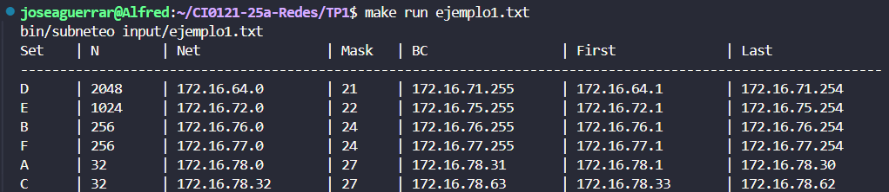
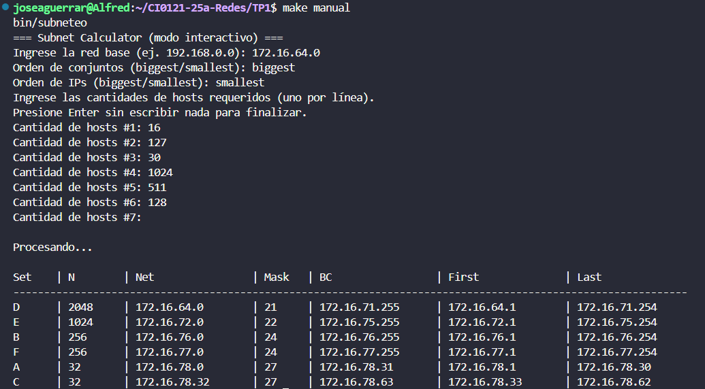

# Subnet Calculator

## Descripción del problema

Este programa permite realizar la asignación de subredes IPv4 para un conjunto de solicitudes de direcciones. A partir de una red base y una lista de cantidades de hosts requeridos, el programa calcula:

- Dirección de red
- Máscara CIDR
- Dirección de broadcast
- Primer y último host utilizable

La asignación se puede hacer desde la IP más baja hacia la más alta o viceversa, y también se puede ordenar por tamaños de subredes (más grandes primero o más pequeñas primero).

---

## Dependencias

El programa está escrito en C++17 y requiere:

- `g++` (versión compatible con C++17)
- `make`

Para instalar las herramientas necesarias:

### En Fedora

```bash
sudo dnf install make gcc-c++
```

### En Ubuntu

```bash
sudo apt install make g++
```

---

## Cómo compilar y ejecutar

### 1. Compilación

```bash
make
```

### 2. Ejecutar con archivo de entrada

```bash
make run ejemplo1.txt
```

### 3. Ejecutar default

```bash
make run
```

**El default hace que se ejecute el programa con el archivo `ejemplo1.txt`**

> Los archivos de entrada deben estar en la carpeta `input/` y seguir el formato:

```
Assigned network: 172.16.64.0 (IP base)
Set: biggest (o smallest)
IP: smallest (o biggest)
(Cantidad de hosts) addresses for range D
(Cantidad de hosts) addresses for range E
(Cantidad de hosts) addresses for range B
...
```

### 3. Ejecutar en modo interactivo (por teclado)

```bash
make manual
```

El programa le pedirá los datos uno a uno (IP base, orden, hosts, etc). Para finalizar, presione `Enter` sin escribir nada.

---

## Ejemplos de uso

### Ejemplo con archivo `ejemplo1.txt`

```bash
make run ejemplo1.txt
```

**Salida esperada:**



---

### Ejemplo en modo interactivo

```bash
make manual
```

```
Ingrese la red base (ej. 192.168.0.0): 172.16.64.0
Orden de conjuntos (biggest/smallest): biggest
Orden de IPs (biggest/smallest): smallest
Ingrese las cantidades de hosts requeridos (uno por línea).
Presione Enter sin escribir nada para finalizar.
Cantidad de hosts #1: 16
Cantidad de hosts #2: 127
Cantidad de hosts #3: 30
Cantidad de hosts #4: 1024
Cantidad de hosts #5: 511
Cantidad de hosts #6: 128
Cantidad de hosts #7: (Enter sin escribir nada para finalizar)
```

**Salida esperada:**



---

## Estructura del proyecto

```
.
├── Makefile
├── Subnet.hpp
├── Subnet.cpp
├── main.cpp
├── .gitignore
├── Manual.md
├── Images/
│   ├── 1.png
│   └── 2.png
├── input/
│   ├── ejemplo1.txt
│   └── ejemplo2.txt
```

---
## Créditos

- José Guerra Rodríguez