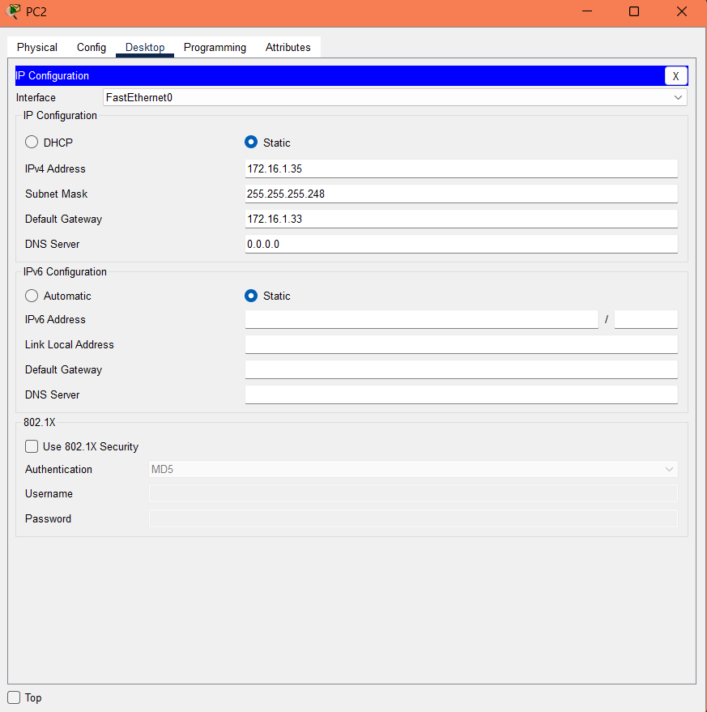
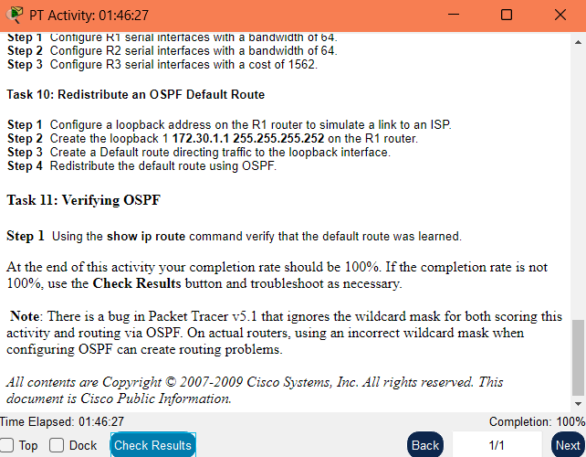

# 11.6.1: Basic OSPF Configuration Lab

## Tabla de Direcciones IP

| Dispositivo | Interfaz  | Dirección IP     | Máscara de Subred   | Gateway por Defecto |
|-------------|-----------|------------------|----------------------|----------------------|
| R1          | Fa0/0     | 172.16.1.17      | 255.255.255.240      | N/A                  |
|             | S0/0/0    | 192.168.10.1     | 255.255.255.252      | N/A                  |
|             | S0/0/1    | 192.168.10.5     | 255.255.255.252      | N/A                  |
| R2          | Fa0/0     | 10.10.10.1       | 255.255.255.0        | N/A                  |
|             | S0/0/0    | 192.168.10.2     | 255.255.255.252      | N/A                  |
|             | S0/0/1    | 192.168.10.9     | 255.255.255.252      | N/A                  |
| R3          | Fa0/0     | 172.16.1.33      | 255.255.255.248      | N/A                  |
|             | S0/0/0    | 192.168.10.6     | 255.255.255.252      | N/A                  |
|             | S0/0/1    | 192.168.10.10    | 255.255.255.252      | N/A                  |
| PC0         | NIC       | 172.16.1.20      | 255.255.255.240      | 172.16.1.17          |
| PC1         | NIC       | 10.10.10.10      | 255.255.255.0        | 10.10.10.1           |
| PC2         | NIC       | 172.16.1.35      | 255.255.255.248      | 172.16.1.33          |

---

## Instrucciones

### Objetivos de Aprendizaje

- Realizar tareas básicas de configuración en routers.
- Configurar y activar interfaces.
- Configurar el enrutamiento OSPF en todos los routers.
- Configurar IDs de router OSPF.
- Verificar el enrutamiento OSPF usando comandos `show`.
- Configurar una ruta por defecto estática.
- Propagar la ruta por defecto a los vecinos OSPF.
- Configurar temporizadores Hello y Dead de OSPF.
- Configurar OSPF en una red multiacceso.
- Configurar la prioridad de OSPF.
- Comprender el proceso de elección en OSPF.
- Documentar la configuración de OSPF.

---

## Task 2: Configuraciones Básicas de los Routers

- Configura el **hostname** de cada router.
- Desactiva la búsqueda DNS.
- Configura la contraseña para modo EXEC: `class`
- Configura la contraseña para acceso por consola: `cisco`
- Configura la contraseña para conexiones VTY: `cisco`

Hacemos esto para cada router:

```bash
Router>enable
Router#configure terminal
Enter configuration commands, one per line.  End with CNTL/Z.
Router(config)#hostname R1
R1(config)#no ip domain-lookup
R1(config)#enable secret class
R1(config)#line console 0
R1(config-line)#password cisco
R1(config-line)#login
R1(config-line)#exit
R1(config)#line vty 0 4
R1(config-line)#password cisco
R1(config-line)#login
R1(config-line)#exit
```

---

## Task 3: Configurar y Activar Interfaces Seriales y Ethernet

1. Configura las interfaces de R1, R2 y R3 con las direcciones IP de la tabla.
2. Configura los PCs con las direcciones IP de la tabla.

Para cada router con su respectiva ip:

```bash
Password: 
R1>enable
Password: 
R1#configure terminal
Enter configuration commands, one per line.  End with CNTL/Z.
R1(config)#interface FastEthernet0/0
R1(config-if)#ip address 172.16.1.17 255.255.255.240
R1(config-if)#no shutdown

R1(config-if)#
%LINK-5-CHANGED: Interface FastEthernet0/0, changed state to up

%LINEPROTO-5-UPDOWN: Line protocol on Interface FastEthernet0/0, changed state to up

R1(config-if)#no shutdown
R1(config-if)#exit
R1(config)#interface Serial0/0/0
R1(config-if)#ip address 192.168.10.1 255.255.255.252
R1(config-if)#no shutdown

%LINK-5-CHANGED: Interface Serial0/0/0, changed state to down
R1(config-if)#exit
R1(config)#interface Serial0/0/1
R1(config-if)#ip address 192.168.10.5 255.255.255.252
R1(config-if)#no shutdown

%LINK-5-CHANGED: Interface Serial0/0/1, changed state to down
R1(config-if)#exit
R1(config)#
```

para cada pc configurar su ip respectiva así:



---

## Task 4: Configurar OSPF en el Router R1

1. Configura OSPF con el **process ID** número 1 y anuncia todas las redes.

Para R1:

```bash
enable
configure terminal
router ospf 1
network 172.16.1.16 0.0.0.15 area 0      
network 192.168.10.0 0.0.0.3 area 0     
network 192.168.10.4 0.0.0.3 area 0     
exit
```

---

## Task 5: Configurar OSPF en los Routers R2 y R3

1. Configura OSPF con el **process ID** número 1 y anuncia todas las redes.

Para R2:

```bash
enable
configure terminal
router ospf 1
network 10.10.10.0 0.0.0.255 area 0       
network 192.168.10.0 0.0.0.3 area 0      
network 192.168.10.8 0.0.0.3 area 0      
exit
```

para R3:

```bash
enable
configure terminal
router ospf 1
network 172.16.1.32 0.0.0.7 area 0        
network 192.168.10.4 0.0.0.3 area 0      
network 192.168.10.8 0.0.0.3 area 0      
exit
```

Se puede verificar la configuración de OSPF en el router R1 con:

```bash
R1#show ip ospf neighbor
Neighbor ID     Pri   State           Dead Time   Address         Interface
10.10.10.1        0   FULL/  -        00:00:32    192.168.10.2    Serial0/0/0
172.16.1.33       0   FULL/  -        00:00:33    192.168.10.6    Serial0/0/1
```

---

## Task 6: Configurar IDs de Router OSPF

1. Configura en R1 una interfaz loopback0 con dirección `10.1.1.1 255.255.255.255`
2. Configura en R2 una interfaz loopback0 con dirección `10.2.2.2 255.255.255.255`
3. Configura en R3 una interfaz loopback0 con dirección `10.3.3.3 255.255.255.255`
4. Copia la configuración en ejecución a NVRAM y reinicia los routers.

Para cada router:

```bash
R1#configure terminal
R1(config)#interface loopback0

R1(config-if)#
%LINK-5-CHANGED: Interface Loopback0, changed state to up

%LINEPROTO-5-UPDOWN: Line protocol on Interface Loopback0, changed state to up

R1(config-if)#ip address 10.1.1.1 255.255.255.255
R1(config-if)#exit
R1(config)#exit
R1#
%SYS-5-CONFIG_I: Configured from console by console

R1#copy running-config startup-config
Destination filename [startup-config]? 
Building configuration...
[OK]
```

---

## Task 7: Verificar la Operación de OSPF

1. Usa el comando `show ip ospf neighbor` para verificar los vecinos OSPF.
2. Usa el comando `show ip protocols` para ver la configuración del protocolo de enrutamiento.

Reiniciar cada router con "reload" y confirmar la configuración con estos comandos:

```bash

Password: 

R1>enable
Password: 
R1#
00:00:35: %OSPF-5-ADJCHG: Process 1, Nbr 10.2.2.2 on Serial0/0/0 from LOADING to FULL, Loading Done
show ip protocols

Routing Protocol is "ospf 1"
  Outgoing update filter list for all interfaces is not set 
  Incoming update filter list for all interfaces is not set 
  Router ID 10.1.1.1
  Number of areas in this router is 1. 1 normal 0 stub 0 nssa
  Maximum path: 4
  Routing for Networks:
    172.16.1.16 0.0.0.15 area 0
    192.168.10.0 0.0.0.3 area 0
    192.168.10.4 0.0.0.3 area 0
  Routing Information Sources:  
    Gateway         Distance      Last Update 
    0.0.0.0              110      00:17:46
    10.1.1.1             110      00:00:05
    10.2.2.2             110      00:00:05
    10.3.3.3             110      00:00:05
    10.10.10.1           110      00:00:29
    172.16.1.33          110      00:10:39
    192.168.10.5         110      00:00:49
  Distance: (default is 110)

R1#show ip ospf neighbor


Neighbor ID     Pri   State           Dead Time   Address         Interface
10.2.2.2          0   FULL/  -        00:00:35    192.168.10.2    Serial0/0/0
10.3.3.3          0   FULL/  -        00:00:32    192.168.10.6    Serial0/0/1
```

---

## Task 8: Examinar las Rutas OSPF en la Tabla de Enrutamiento

1. Usa el comando `show ip route` para ver todas las redes aprendidas vía OSPF.

Para cada router:

```bash
R1#show ip route
Codes: C - connected, S - static, I - IGRP, R - RIP, M - mobile, B - BGP
       D - EIGRP, EX - EIGRP external, O - OSPF, IA - OSPF inter area
       N1 - OSPF NSSA external type 1, N2 - OSPF NSSA external type 2
       E1 - OSPF external type 1, E2 - OSPF external type 2, E - EGP
       i - IS-IS, L1 - IS-IS level-1, L2 - IS-IS level-2, ia - IS-IS inter area
       * - candidate default, U - per-user static route, o - ODR
       P - periodic downloaded static route

Gateway of last resort is not set

     10.0.0.0/8 is variably subnetted, 2 subnets, 2 masks
C       10.1.1.1/32 is directly connected, Loopback0
O       10.10.10.0/24 [110/65] via 192.168.10.2, 00:03:37, Serial0/0/0
     172.16.0.0/16 is variably subnetted, 2 subnets, 2 masks
C       172.16.1.16/28 is directly connected, FastEthernet0/0
O       172.16.1.32/29 [110/65] via 192.168.10.6, 00:03:47, Serial0/0/1
     192.168.10.0/30 is subnetted, 3 subnets
C       192.168.10.0 is directly connected, Serial0/0/0
C       192.168.10.4 is directly connected, Serial0/0/1
O       192.168.10.8 [110/128] via 192.168.10.6, 00:03:37, Serial0/0/1
                     [110/128] via 192.168.10.2, 00:03:37, Serial0/0/0
```

**R1**
Aprende por OSPF:

10.10.10.0/24 (PC1, de R2)

172.16.1.32/29 (PC2, de R3)

192.168.10.8/30 (enlace R2-R3)

**R2**
Aprende por OSPF:

172.16.1.16/28 (PC0, de R1)

172.16.1.32/29 (PC2, de R3)

192.168.10.4/30 (enlace R1-R3)

**R3**
Aprende por OSPF:

10.10.10.0/24 (PC1, de R2)

172.16.1.16/28 (PC0, de R1)

192.168.10.0/30 (enlace R1-R2)

**Además, cada router:**

Tiene sus redes conectadas directamente (C).

Y ha aprendido todas las redes remotas vía OSPF (O), como debe ser.

Esto confirma que el enrutamiento OSPF está funcionando correctamente entre todos los routers

---

## Task 9: Configurar el Costo de OSPF

1. Configura en R1 el **bandwidth** de las interfaces seriales a 64.
2. Configura en R2 el **bandwidth** de las interfaces seriales a 64.
3. Configura en R3 el **costo** de las interfaces seriales a 1562.

Para los routers R1 y R2:

```bash
R1#configure terminal
Enter configuration commands, one per line.  End with CNTL/Z.
R1(config)#interface Serial0/0/0
R1(config-if)#bandwidth 64
R1(config-if)#exit
R1(config)#interface Serial0/0/1
R1(config-if)#bandwidth 64
R1(config-if)#exit
```

Para R3:

```bash
R3#configure terminal
Enter configuration commands, one per line.  End with CNTL/Z.
R3(config)#interface Serial0/0/0
R3(config-if)#ip ospf cost 1562
R3(config-if)#exit
R3(config)#interface Serial0/0/1
R3(config-if)#ip ospf cost 1562
R3(config-if)#exit
```

Para revisar los costos:

```bash
R3#show ip ospf interface serial0/0/1

Serial0/0/1 is up, line protocol is up
  Internet address is 192.168.10.10/30, Area 0
  Process ID 1, Router ID 10.3.3.3, Network Type POINT-TO-POINT, Cost: 1562
  Transmit Delay is 1 sec, State POINT-TO-POINT,
  Timer intervals configured, Hello 10, Dead 40, Wait 40, Retransmit 5
    Hello due in 00:00:05
  Index 3/3, flood queue length 0
  Next 0x0(0)/0x0(0)
  Last flood scan length is 1, maximum is 1
  Last flood scan time is 0 msec, maximum is 0 msec
  Neighbor Count is 1 , Adjacent neighbor count is 1
    Adjacent with neighbor 10.2.2.2
  Suppress hello for 0 neighbor(s)
```

---

## Task 10: Redistribuir una Ruta por Defecto OSPF

1. Configura una interfaz loopback en R1 para simular un enlace al ISP.
2. Crea `loopback1` con dirección `172.30.1.1 255.255.255.252` en R1.
3. Crea una ruta por defecto dirigida a esa interfaz loopback.
4. Redistribuye la ruta por defecto usando OSPF.

Para R1:

```bash
R1#configure terminal
Enter configuration commands, one per line.  End with CNTL/Z.
R1(config)#interface loopback1

R1(config-if)#
%LINK-5-CHANGED: Interface Loopback1, changed state to up

%LINEPROTO-5-UPDOWN: Line protocol on Interface Loopback1, changed state to up

R1(config-if)#ip address 172.30.1.1 255.255.255.252
R1(config)#interface FastEthernet0/1
R1(config-if)#no ip address
R1(config-if)#shutdown
R1(config-if)#exit
R1(config)#interface loopback1
R1(config-if)#ip address 172.30.1.1 255.255.255.252
R1(config-if)#exit
R1(config)#ip route 0.0.0.0 0.0.0.0 Loopback1
R1(config)#router ospf 1
R1(config-router)#default-information originate
R1(config-router)#exit
R1(config)#exit
R1#copy running-config startup-config
Destination filename [startup-config]? 
Building configuration...
[OK]
```

---

## Task 11: Verificación Final de OSPF

1. Usa el comando `show ip route` para verificar que la ruta por defecto fue aprendida.

En R2 y R3:

```bash
R2#show ip route
Codes: C - connected, S - static, I - IGRP, R - RIP, M - mobile, B - BGP
       D - EIGRP, EX - EIGRP external, O - OSPF, IA - OSPF inter area
       N1 - OSPF NSSA external type 1, N2 - OSPF NSSA external type 2
       E1 - OSPF external type 1, E2 - OSPF external type 2, E - EGP
       i - IS-IS, L1 - IS-IS level-1, L2 - IS-IS level-2, ia - IS-IS inter area
       * - candidate default, U - per-user static route, o - ODR
       P - periodic downloaded static route

Gateway of last resort is 192.168.10.1 to network 0.0.0.0

     10.0.0.0/8 is variably subnetted, 2 subnets, 2 masks
C       10.2.2.2/32 is directly connected, Loopback0
C       10.10.10.0/24 is directly connected, FastEthernet0/0
     172.16.0.0/16 is variably subnetted, 2 subnets, 2 masks
O       172.16.1.16/28 [110/1563] via 192.168.10.1, 00:35:40, Serial0/0/0
O       172.16.1.32/29 [110/1563] via 192.168.10.10, 00:35:40, Serial0/0/1
     192.168.10.0/30 is subnetted, 3 subnets
C       192.168.10.0 is directly connected, Serial0/0/0
O       192.168.10.4 [110/3124] via 192.168.10.10, 00:35:18, Serial0/0/1
                     [110/3124] via 192.168.10.1, 00:35:18, Serial0/0/0
C       192.168.10.8 is directly connected, Serial0/0/1
O*E2 0.0.0.0/0 [110/1] via 192.168.10.1, 00:00:56, Serial0/0/0
```

La última línea indica que aprendió la ruta por defecto a través de OSPF.

---

**Nota:** Existe un bug en Packet Tracer v5.1 que ignora la máscara comodín (wildcard mask) tanto para la evaluación como para el enrutamiento OSPF. En routers reales, usar una wildcard incorrecta puede provocar problemas de enrutamiento.

**Completitud de tarea:**


---
