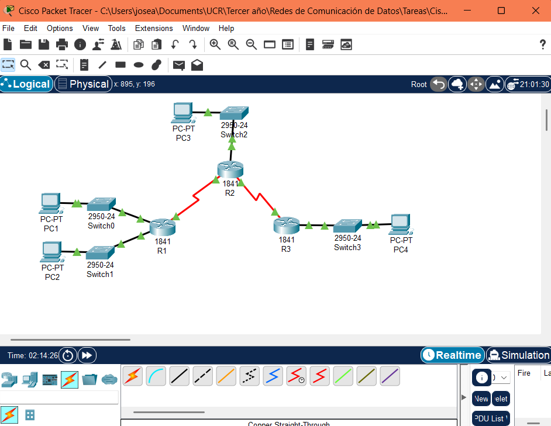
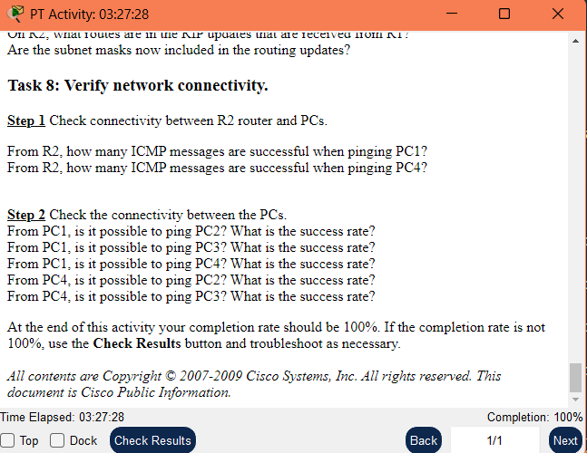

# Activity 7.5.1: RIPv2 Basic Configuration Lab

## Learning Objectives

- Cable a network according to the topology diagram.
- Load provided scripts onto the routers.
- Examine the current status of the network.
- Configure RIPv2 on all routers.
- Examine the automatic summarization of routes.
- Examine routing updates with `debug ip rip`.
- Disable automatic summarization.
- Examine the routing tables.
- Verify network connectivity.
- Document the RIPv2 configuration.

## Scenario

This activity uses a topology with a discontiguous network, 172.30.0.0. This network has been subnetted using VLSM. The 172.30.0.0 subnets are physically and logically divided by at least one other classful or major network, in this case the two serial networks 209.165.200.228/30 and 209.165.200.232/30. This can be an issue when the routing protocol used does not include enough information to distinguish the individual subnets. RIPv2 is a classless routing protocol that can be used to provide subnet mask information in the routing updates. This will allow VLSM subnet information to be propagated throughout the network.

## Task 1: Cable the network

**Step 1**: Cable the network using the chart and the existing devices in the activity.




## Task 2: Load the routers with the supplied scripts

**Step 1**: Load the following script onto R1.

```bash
hostname R1

interface FastEthernet0/0
ip address 172.30.1.1 255.255.255.0
duplex auto
speed auto
no shutdown

interface FastEthernet0/1
ip address 172.30.2.1 255.255.255.0
duplex auto
speed auto
no shutdown

interface Serial0/0/0
ip address 209.165.200.230 255.255.255.252
clock rate 64000
no shutdown

router rip
passive-interface FastEthernet0/0
passive-interface FastEthernet0/1
network 172.30.0.0
network 209.165.200.0

line con 0
line vty 0 4
password cisco
login

end
```

**Step 2**: Load the following script onto R2.

```bash
hostname R2

interface FastEthernet0/0
ip address 10.1.0.1 255.255.0.0
duplex auto
speed auto
no shutdown

interface Serial0/0/0
ip address 209.165.200.229 255.255.255.252
no shutdown

interface Serial0/0/1
ip address 209.165.200.233 255.255.255.252
clock rate 64000
no shutdown

router rip
passive-interface FastEthernet0/0
network 10.0.0.0
network 209.165.200.0

line con 0
line vty 0 4
login

end
```

**Step 3**: Load the following script onto R3.

```bash
hostname R3

interface FastEthernet0/0
ip address 172.30.100.1 255.255.255.0
duplex auto
speed auto
no shutdown

interface Serial0/0/1
ip address 209.165.200.234 255.255.255.252
no shutdown

interface Loopback0
ip address 172.30.110.1 255.255.255.0

interface Loopback1
ip address 172.30.200.17 255.255.255.240

interface Loopback2
ip address 172.30.200.33 255.255.255.240

router rip
passive-interface FastEthernet0/0
network 172.30.0.0
network 209.165.200.0

line con 0
line vty 0 4
login

end
```

## Task 3: Examine the current status of the network

**Step 1**: Verify that both serial links are up.  
The status of the two serial links can quickly be verified using the `show ip interface brief` command on R2. Both serial interfaces should show Status as up and Protocol as up.

```bash
R2#show ip interface brief
Interface              IP-Address      OK? Method Status                Protocol
FastEthernet0/0        10.1.0.1        YES manual up                    up
FastEthernet0/1        unassigned      YES unset  administratively down down
Serial0/0/0            209.165.200.229 YES manual up                    up
Serial0/0/1            209.165.200.233 YES manual up                    up
Vlan1                  unassigned      YES unset  administratively down down
```

**Step 2**: Check the connectivity from R2 to the hosts on the R1 and R3 LANs.  
From the R2 router, how many ICMP messages are successful when pinging PC1?  

```bash
R2#ping 172.30.1.10

Type escape sequence to abort.
Sending 5, 100-byte ICMP Echos to 172.30.1.10, timeout is 2 seconds:
.U!.!
Success rate is 40 percent (2/5), round-trip min/avg/max = 9/17/16 ms
```

From the R2 router, how many ICMP messages are successful when pinging PC4?

```bash
R2#ping 172.30.110.10

Type escape sequence to abort.
Sending 5, 100-byte ICMP Echos to 172.30.110.10, timeout is 2 seconds:
.U.U.
Success rate is 0 percent (0/5)
```

**Step 3**: Check the connectivity between the PCs.  
From PC1, is it possible to ping PC2? What is the success rate?  

```bash
C:\>ping 172.30.2.10

Pinging 172.30.2.10 with 32 bytes of data:

Reply from 172.30.1.1: Destination host unreachable.
Request timed out.
Reply from 172.30.1.1: Destination host unreachable.
Reply from 172.30.1.1: Destination host unreachable.

Ping statistics for 172.30.2.10:
    Packets: Sent = 4, Received = 0, Lost = 4 (100% loss),
```

From PC1, is it possible to ping PC3? What is the success rate?  

```bash
C:\>ping 172.30.100.10

Pinging 172.30.100.10 with 32 bytes of data:

Reply from 172.30.1.1: Destination host unreachable.
Request timed out.
Reply from 172.30.1.1: Destination host unreachable.
Reply from 172.30.1.1: Destination host unreachable.

Ping statistics for 172.30.100.10:
    Packets: Sent = 4, Received = 0, Lost = 4 (100% loss),

```

From PC1, is it possible to ping PC4? What is the success rate?

```bash
C:\>ping 172.30.110.10

Pinging 172.30.110.10 with 32 bytes of data:

Reply from 172.30.1.1: Destination host unreachable.
Request timed out.
Reply from 172.30.1.1: Destination host unreachable.
Reply from 172.30.1.1: Destination host unreachable.

Ping statistics for 172.30.110.10:
    Packets: Sent = 4, Received = 0, Lost = 4 (100% loss),
```

From PC4, is it possible to ping PC2? What is the success rate?

```bash
C:\>ping 172.30.2.10

Pinging 172.30.2.10 with 32 bytes of data:

Request timed out.
Request timed out.
Request timed out.
Request timed out.

Ping statistics for 172.30.2.10:
    Packets: Sent = 4, Received = 0, Lost = 4 (100% loss),
```

From PC4, is it possible to ping PC3? What is the success rate?

```bash
C:\>ping 172.30.100.10

Pinging 172.30.100.10 with 32 bytes of data:

Request timed out.
Request timed out.
Request timed out.
Request timed out.

Ping statistics for 172.30.100.10:
    Packets: Sent = 4, Received = 0, Lost = 4 (100% loss),
```

### Conclusión del Step 3

Actualmente, ninguna PC puede comunicarse con otra. Esto es totalmente consistente con lo que se espera al usar RIPv1 con resumen automático, ya que los routers:

Solo conocen 172.30.0.0/16, pero no saben a qué subred específica pertenece cada destino.

Esto genera pérdida de paquetes porque los routers creen que ya conocen la red, pero no tienen la máscara correcta para enrutarla.

**Step 4**: View the routing table on R2.  
Use the `show ip route` command to view the routing table on R2. Both the R1 and R3 are advertising routes to the 172.30.0.0/16 network; therefore, there are two entries for this network in the R2 routing table. The R2 routing table only shows the major classful network address of 172.30.0.0—it does not show any of the subnets for this network that are used on the LANs attached to R1 and R3. Because the routing metric is the same for both entries, the router alternates the routes that are used when forwarding packets that are destined for the 172.30.0.0/16 network.

```bash
R2#show ip route
Codes: C - connected, S - static, I - IGRP, R - RIP, M - mobile, B - BGP
       D - EIGRP, EX - EIGRP external, O - OSPF, IA - OSPF inter area
       N1 - OSPF NSSA external type 1, N2 - OSPF NSSA external type 2
       E1 - OSPF external type 1, E2 - OSPF external type 2, E - EGP
       i - IS-IS, L1 - IS-IS level-1, L2 - IS-IS level-2, ia - IS-IS inter area
       * - candidate default, U - per-user static route, o - ODR
       P - periodic downloaded static route

Gateway of last resort is not set

     10.0.0.0/16 is subnetted, 1 subnets
C       10.1.0.0 is directly connected, FastEthernet0/0
R    172.30.0.0/16 [120/1] via 209.165.200.230, 00:00:20, Serial0/0/0
                   [120/1] via 209.165.200.234, 00:00:05, Serial0/0/1
     209.165.200.0/30 is subnetted, 2 subnets
C       209.165.200.228 is directly connected, Serial0/0/0
C       209.165.200.232 is directly connected, Serial0/0/1
```

**Ambos routers (R1 y R3) están anunciando la red 172.30.0.0/16 a través de RIP.**

**Como la métrica es la misma (120/1), R2 alternará entre ambas rutas para enrutar paquetes hacia esa red.**

**No se ven las subredes reales como 172.30.1.0, 172.30.100.0, etc., debido a que RIPv1 no incluye máscara de subred y está haciendo sumarización automática.**

**Esto puede causar que R2 no enrute correctamente los paquetes, ya que no distingue entre subredes de R1 y R3.**

**Step 5**: Examine the routing table on R1.  
Use the `show ip route` command to view the routing table on R1. Both R1 and R3 are configured with interfaces on a discontiguous network, 172.30.0.0. The 172.30.0.0 subnets are physically and logically divided by at least one other classful or major network—in this case, the two serial networks 209.165.200.228/32 and 209.165.200.232/30. Classful routing protocols like RIPv1 summarize networks at major network boundaries. Both R1 and R3 will be summarizing 172.30.0.0 subnets to 172.30.0.0. Because the route to 172.30.0.0/16 is directly connected, and because R1 does not have any specific routes for the 172.30.0.0 subnets on R3, packets destined for the R3 LANs will not be forwarded properly.

```bash
R1#show ip route
Codes: C - connected, S - static, I - IGRP, R - RIP, M - mobile, B - BGP
       D - EIGRP, EX - EIGRP external, O - OSPF, IA - OSPF inter area
       N1 - OSPF NSSA external type 1, N2 - OSPF NSSA external type 2
       E1 - OSPF external type 1, E2 - OSPF external type 2, E - EGP
       i - IS-IS, L1 - IS-IS level-1, L2 - IS-IS level-2, ia - IS-IS inter area
       * - candidate default, U - per-user static route, o - ODR
       P - periodic downloaded static route

Gateway of last resort is not set

R    10.0.0.0/8 [120/1] via 209.165.200.229, 00:00:13, Serial0/0/0
     172.30.0.0/24 is subnetted, 1 subnets
C       172.30.1.0 is directly connected, FastEthernet0/0
     209.165.200.0/30 is subnetted, 2 subnets
C       209.165.200.228 is directly connected, Serial0/0/0
R       209.165.200.232 [120/1] via 209.165.200.229, 00:00:13, Serial0/0/0
```

**R1 no tiene rutas hacia las subredes de R3, a pesar de estar en la misma red claseful (172.30.0.0)**
**Esto ocurre por la sumarización automática de RIP versión 1, que agrupa todas las subredes como una sola.**

**El resultado es que los paquetes hacia PC3 o PC4 se pierden, ya que R1 no sabe a dónde enviarlos.**

**Step 6**: Examine the routing table on R3.  
Use the `show ip route` command to view the routing table on R3. R3 only shows its own subnets for 172.30.0.0 network: 172.30.100/24, 172.30.110/24, 172.30.200.16/28, and 172.30.200.32/28. R3 does not have any routes for the 172.30.0.0 subnets on R1.

```bash
R3#show ip route
Codes: C - connected, S - static, I - IGRP, R - RIP, M - mobile, B - BGP
       D - EIGRP, EX - EIGRP external, O - OSPF, IA - OSPF inter area
       N1 - OSPF NSSA external type 1, N2 - OSPF NSSA external type 2
       E1 - OSPF external type 1, E2 - OSPF external type 2, E - EGP
       i - IS-IS, L1 - IS-IS level-1, L2 - IS-IS level-2, ia - IS-IS inter area
       * - candidate default, U - per-user static route, o - ODR
       P - periodic downloaded static route

Gateway of last resort is not set

R    10.0.0.0/8 [120/1] via 209.165.200.233, 00:00:27, Serial0/0/1
     172.30.0.0/16 is variably subnetted, 3 subnets, 2 masks
C       172.30.110.0/24 is directly connected, Loopback0
C       172.30.200.16/28 is directly connected, Loopback1
C       172.30.200.32/28 is directly connected, Loopback2
     209.165.200.0/30 is subnetted, 2 subnets
R       209.165.200.228 [120/1] via 209.165.200.233, 00:00:27, Serial0/0/1
C       209.165.200.232 is directly connected, Serial0/0/1
```

**R3 solo tiene conectadas localmente las siguientes subredes del bloque 172.30.0.0:**

**172.30.110.0/24**
**172.30.200.16/28**
**172.30.200.32/28**

**No tiene rutas RIP hacia:**

**172.30.1.0/24 (PC1)**
**172.30.2.0/24 (PC2)**

**Solo conoce 10.0.0.0/8 (LAN de R2) y 209.165.200.228 (enlace R1-R2) vía RIP.**

**Step 7**: Examine the RIPv1 packets that are being received by R2.  
Use the `debug ip rip` command to display RIP routing updates. R2 is receiving the route 172.30.0.0, with 1 hop, from both R1 and R3. Because these are equal cost metrics, both routes are added to the R2 routing table. Because RIPv1 is a classful routing protocol, no subnet mask information is sent in the update.

When you are finished, disable the debugging:  

```bash
R2#undebug all
```

```bash
R2#debug ip rip
RIP protocol debugging is on
R2#RIP: received v2 update from 209.165.200.234 on Serial0/0/1
      172.30.0.0/16 via 0.0.0.0 in 1 hops
RIP: sending  v2 update to 224.0.0.9 via Serial0/0/0 (209.165.200.229)
RIP: build update entries
      10.0.0.0/8 via 0.0.0.0, metric 1, tag 0
      209.165.200.232/30 via 0.0.0.0, metric 1, tag 0
RIP: sending  v2 update to 224.0.0.9 via Serial0/0/1 (209.165.200.233)
RIP: build update entries
      10.0.0.0/8 via 0.0.0.0, metric 1, tag 0
      209.165.200.228/30 via 0.0.0.0, metric 1, tag 0
undebug all
All possible debugging has been turned off
```

## Task 4: Configure RIP Version 2

**Step 1**: Use the `version 2` command to enable RIP version 2 on each router.

```bash
R2(config)#router rip
R2(config-router)#version 2

R1(config)#router rip
R1(config-router)#version 2

R3(config)#router rip
R3(config-router)#version 2
```

RIPv2 messages include the subnet mask in a field in the routing updates. This allows subnets and their masks to be included in the routing updates. However, by default RIPv2 summarizes networks at major network boundaries, just like RIPv1, except that the subnet mask is included in the update.

**Step 2**: Verify that RIPv2 is running on the routers.  
The `debug ip rip`, `show ip protocols`, and `show run` commands can all be used to confirm that RIPv2 is running.

```bash
R2#show ip protocols
Routing Protocol is "rip"
Sending updates every 30 seconds, next due in 2 seconds
Invalid after 180 seconds, hold down 180, flushed after 240
Outgoing update filter list for all interfaces is not set
Incoming update filter list for all interfaces is not set
Redistributing: rip
Default version control: send version 2, receive 2
  Interface             Send  Recv  Triggered RIP  Key-chain
  Serial0/0/0           22
  Serial0/0/1           22
Automatic network summarization is in effect
Maximum path: 4
Routing for Networks:
 10.0.0.0
 209.165.200.0
Passive Interface(s):
 FastEthernet0/0
Routing Information Sources:
 Gateway         Distance      Last Update
 209.165.200.230      120      00:00:04
 209.165.200.234      120      00:00:01
Distance: (default is 120)
```

**RIPv2 está activo en todos los routers.**

## Task 5: Examine the Automatic Summarization of Routes

**Step 1**: Use the `show ip route` command on each router.  
The LANs connected to R1 and R3 are still composed of discontiguous networks. R2 still shows two equal cost paths to the 172.30.0.0/16 network in the routing table. R2 still shows only the major classful network address of 172.30.0.0 and does not show any of the subnets for this network.

Use the output of the `debug ip rip` command to answer the following questions:  

- What entries are included in the RIP updates sent out from R3?
Respuesta: R3 está enviando únicamente la ruta resumida 172.30.0.0/16 en sus actualizaciones RIP.
No incluye subredes específicas como 172.30.100.0/24, 172.30.110.0/24, ni 172.30.200.16/28 debido a que la sumarización automática de RIPv2 está habilitada.
Esto hace que otros routers no reciban detalles de sus subredes reales.

- On R2, what routes are in the RIP updates that are received from R3?

R2 está recibiendo únicamente la ruta resumida 172.30.0.0/16 desde R3, con la máscara /16 incluida (porque ya está usando RIPv2).
Sin embargo, no se reciben las subredes reales de R3.
Esto ocurre porque R3 está haciendo sumarización automática, y por eso ni R2 ni R1 pueden ver ni enrutar hacia las subredes específicas del router R3.

## Task 6: Disable Automatic Summarization

The `no auto-summary` command is used to turn off automatic summarization in RIPv2. Disable auto summarization on all routers.

```bash
R2(config)#router rip
R2(config-router)#no auto-summary

R1(config)#router rip
R1(config-router)#no auto-summary

R3(config)#router rip
R3(config-router)#no auto-summary
```

## Task 7: Examine the routing tables

Use the `show ip route` commands on all three routers to view the routing tables. The LANs connected to R1 and R3 should now be included in all three routing tables.

```bash
R1#show ip route
Codes: C - connected, S - static, I - IGRP, R - RIP, M - mobile, B - BGP
       D - EIGRP, EX - EIGRP external, O - OSPF, IA - OSPF inter area
       N1 - OSPF NSSA external type 1, N2 - OSPF NSSA external type 2
       E1 - OSPF external type 1, E2 - OSPF external type 2, E - EGP
       i - IS-IS, L1 - IS-IS level-1, L2 - IS-IS level-2, ia - IS-IS inter area
       * - candidate default, U - per-user static route, o - ODR
       P - periodic downloaded static route

Gateway of last resort is not set

     10.0.0.0/16 is subnetted, 1 subnets
R       10.1.0.0 [120/1] via 209.165.200.229, 00:00:21, Serial0/0/0
     172.30.0.0/16 is variably subnetted, 5 subnets, 2 masks
C       172.30.1.0/24 is directly connected, FastEthernet0/0
R       172.30.100.0/24 [120/2] via 209.165.200.229, 00:00:21, Serial0/0/0
R       172.30.110.0/24 [120/2] via 209.165.200.229, 00:00:21, Serial0/0/0
R       172.30.200.16/28 [120/2] via 209.165.200.229, 00:00:21, Serial0/0/0
R       172.30.200.32/28 [120/2] via 209.165.200.229, 00:00:21, Serial0/0/0
     209.165.200.0/30 is subnetted, 2 subnets
C       209.165.200.228 is directly connected, Serial0/0/0
R       209.165.200.232 [120/1] via 209.165.200.229, 00:00:21, Serial0/0/0
```

Use the output of the `debug ip rip` command to answer the following questions:  

- What entries are included in the RIP updates sent out from R1?  
R1 está enviando la siguiente ruta en sus actualizaciones RIP:

172.30.1.0/24

Esta es la subred directamente conectada a su interfaz FastEthernet0/0. La máscara /24 confirma que se está utilizando RIPv2 sin sumarización automática.

- On R2, what routes are in the RIP updates that are received from R1? 
R2 está recibiendo la siguiente ruta desde R1:

172.30.1.0/24 vía Serial0/0/0 con 1 salto de distancia.

Esto indica que R2 ya puede identificar correctamente la subred específica de R1.

- Are the subnet masks now included in the routing updates?
Sí, las actualizaciones RIP ahora incluyen las máscaras de subred, ya que se está usando RIPv2 y se desactivó la sumarización automática.

## Task 8: Verify network connectivity

**Step 1**: Check connectivity between R2 router and PCs.  
From R2, how many ICMP messages are successful when pinging PC1?

```bash
R2#ping 172.30.1.10

Type escape sequence to abort.
Sending 5, 100-byte ICMP Echos to 172.30.1.10, timeout is 2 seconds:
!!!!!
Success rate is 100 percent (5/5), round-trip min/avg/max = 3/7/10 ms
```

From R2, how many ICMP messages are successful when pinging PC4?

```bash
R2#ping 172.30.100.10

Type escape sequence to abort.
Sending 5, 100-byte ICMP Echos to 172.30.100.10, timeout is 2 seconds:
!!!!!
Success rate is 100 percent (5/5), round-trip min/avg/max = 7/11/19 ms
```

**Step 2**: Check the connectivity between the PCs.  
From PC1, is it possible to ping PC2? What is the success rate?

```bash
C:\>ping 172.30.2.10 

Pinging 172.30.2.10 with 32 bytes of data:

Reply from 172.30.2.10: bytes=32 time<1ms TTL=127
Reply from 172.30.2.10: bytes=32 time<1ms TTL=127
Reply from 172.30.2.10: bytes=32 time<1ms TTL=127
Reply from 172.30.2.10: bytes=32 time<1ms TTL=127

Ping statistics for 172.30.2.10:
    Packets: Sent = 4, Received = 4, Lost = 0 (0% loss),
Approximate round trip times in milli-seconds:
    Minimum = 0ms, Maximum = 0ms, Average = 0ms
```

From PC1, is it possible to ping PC3? What is the success rate?
**Sí, 100% de éxito.**
From PC1, is it possible to ping PC4? What is the success rate?  
**Sí, 100% de éxito.**
From PC4, is it possible to ping PC2? What is the success rate?  
**Sí, 100% de éxito.**
From PC4, is it possible to ping PC3? What is the success rate?
**Sí, 100% de éxito.**

At the end of this activity your completion rate should be 100%. If the completion rate is not 100%, use the **Check Results** button and troubleshoot as necessary.


