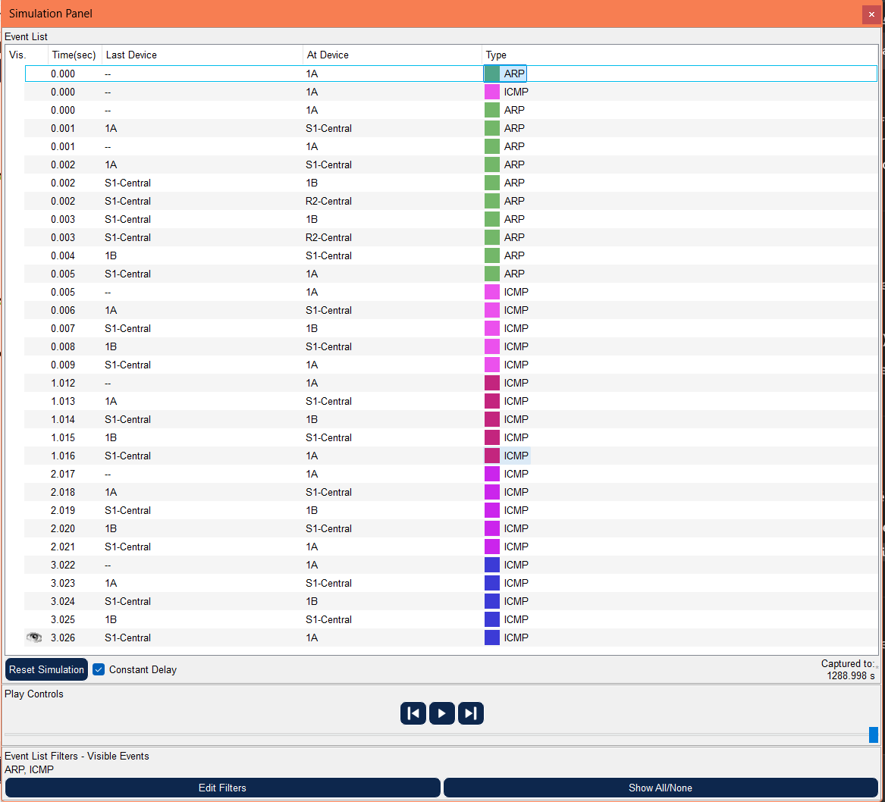

# Address Resolution Protocol (ARP)

## Addressing Table

This activity does not include an addressing table.

## Learning Objectives

* Use Packet Tracer's arp command
* Use Packet Tracer to examine ARP exchanges

## Introduction

Address Resolution Protocol (ARP) is used by TCP/IP to map a Layer 3 IP address to a Layer 2 MAC address. When a frame is placed on the network, it must have a destination MAC address. To dynamically discover the MAC address to the destination device, an ARP request is broadcast on the LAN. The device that contains the destination IP address responds, and the MAC address is recorded in ARP cache. Every device on the LAN keeps its own ARP cache, or small area in RAM that holds ARP results. An ARP cache timer removes ARP entries that have not been used for a certain period of time. Depending on the device, times differ. For example, some Windows operating systems store ARP cache entries for 2 minutes. If the entry is used again during that time, the ARP timer for that entry is extended to 10 minutes.

ARP is an excellent example in performance tradeoff. With no cache, ARP must continually request address translations each time a frame is placed on the network. This adds latency to the communication and could congest the LAN. Conversely, unlimited hold times could cause errors with devices that leave the network or change the Layer 3 address.

A network engineer needs to be aware of ARP but may not interact with the protocol on a regular basis. ARP is a protocol that enables network devices to communicate with the TCP/IP protocol. Without ARP, there is no efficient method to build the datagram Layer 2 destination address. Also, ARP is a potential security risk. ARP spoofing, or ARP poisoning, is a technique used by an attacker to inject the wrong MAC address association in a network. An attacker forges the MAC address of a device, and frames are sent to the wrong destination. Manually configuring static ARP associations is one way to prevent ARP spoofing. Finally, an authorized MAC address list may be configured Cisco devices to restrict network access to only approved devices.

## Task 1: Use Packet Tracer's arp command

### Step 1. Access the Command Prompt

Use the Command Prompt button from the Desktop of PC 1A. The arp command shows only the options available in Packet Tracer.

### Step 2. Use the ping command to dynamically add entries in the ARP cache

The ping command can be used to test network connectivity. By accessing other devices, ARP
associations are dynamically added to ARP cache. Ping the 255.255.255.255 address on PC 1A and the issue the arp -a command to view learned MAC addresses.

```bash
C:\>ping 172.16.255.254

Pinging 172.16.255.254 with 32 bytes of data:

Reply from 172.16.255.254: bytes=32 time<1ms TTL=255
Reply from 172.16.255.254: bytes=32 time<1ms TTL=255
Reply from 172.16.255.254: bytes=32 time<1ms TTL=255
Reply from 172.16.255.254: bytes=32 time<1ms TTL=255

Ping statistics for 172.16.255.254:
    Packets: Sent = 4, Received = 4, Lost = 0 (0% loss),
Approximate round trip times in milli-seconds:
    Minimum = 0ms, Maximum = 0ms, Average = 0ms

C:\>arp -a
  Internet Address      Physical Address      Type
  172.16.255.254        0006.2aed.9e42        dynamic

```

**En este caso se usó el default gateway para hacer ping ya que la 255.255.255.255 no permitio el ping**

## Task 2: Use Packet Tracer to examine ARP exchanges

### Step 1. Configure Packet Tracer for packet captures

Enter Simulation mode. Verify that the Event List Filters display only ARP and ICMP events.

### Step 2. Prepare the pod host computer for ARP captures

Use the Packet Tracer command arp -d. on PC 1A. Then Ping the address 255.255.255.255.

```bash
C:\>arp -d
C:\>ping 172.16.1.2

Pinging 172.16.1.2 with 32 bytes of data:

Reply from 172.16.1.2: bytes=32 time=9ms TTL=128
Reply from 172.16.1.2: bytes=32 time=4ms TTL=128
Reply from 172.16.1.2: bytes=32 time=4ms TTL=128
Reply from 172.16.1.2: bytes=32 time=4ms TTL=128

Ping statistics for 172.16.1.2:
    Packets: Sent = 4, Received = 4, Lost = 0 (0% loss),
Approximate round trip times in milli-seconds:
    Minimum = 4ms, Maximum = 9ms, Average = 5ms
```

**Este ping fue con el host B**

### Step 3. Capture and evaluate ARP communication

For the  ping, after issuing the command, click the Auto Capture / Play to capture the packets. When the Buffer Full window opens, click the View Previous Events button.

