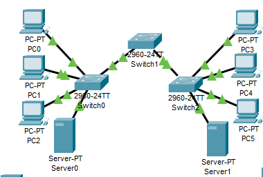
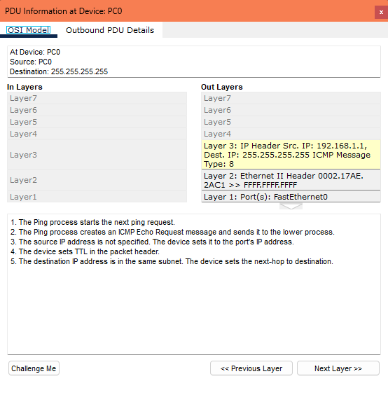
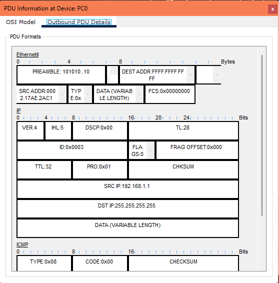
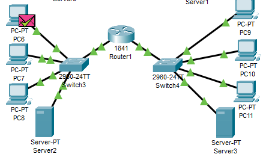
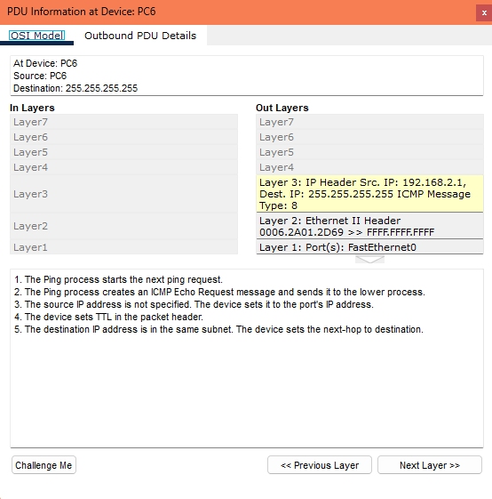
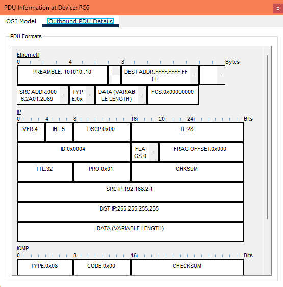

# Actividad 5.2.2-Dominios de broadcast de segmentos de routers

## Objetivos de aprendizaje

*Examinar el comportamiento que se observa al hacer ping a la dirección de broadcast de una red no segmentada y conmutada

*Examinar el comportamiento que se observa al hacer ping a la dirección de broadcast de una red segmentada y enrutada

## Introducción

Los paquetes de broadcast se envían a todos los hosts de una red. Los broadcasts generan tráfico excesivo en la red y requieren que cada dispositivo de la red examine el paquete. La región de la red que recibe un broadcast se denomina dominio de broadcast. Los switches de la Capa 2 extienden los dominios de broadcast. Los dispositivos que realizan los procesos de enrutamiento de la Capa 3 dividen los dominios de broadcast.

A veces es más conveniente modelar redes separadas en el mismo archivo de Packet Tracer. En este archivo existen dos redes distintas. El paquete Escenario 0 está conmutado y el paquete Escenario 1 está enrutado.

**NOTA: Cuando las redes conmutadas se cargan por primera vez en Packet Tracer, se puede experimentar un retraso en las luces de los enlaces, que se tornan color verde mientras ejecutan los cálculos iniciales del protocolo Spanning Tree. Cambiar del modo de tiempo real al modo de simulación 3 ó 4 veces acelerará este proceso.**

## Tarea 1: Ejecutar la simulación utilizando Escenario 0

### Paso 1. Ingrese al modo simulación

Haga clic entre los modos **Simulación** y **Tiempo real** tres o cuatro veces para despejar el protocolo Spanning Tree en los puertos de switch, mantenga a Packet Tracer en modo **Simulación**.

### Paso 2. Recorra el Escenario 0

El archivo se cargará con Escenario 0, que consiste de una PDU simple (un sólo ping) desde la PC 0 a la dirección de broadcast 255.255.255.255. Haga clic en el cuadro de color **Información** junto a la lista de este paquete en **Lista de eventos** (o de modo equivalente, haga clic en el sobre del paquete que se muestra en la PC 0) y examine las vistas**Modelo OSI** y **Detalles de la PDU saliente** del paquete. Luego haga clic en el botón **Capturar/Reenviar** y observe el traslado del broadcast a todos los dispositivos de la red conmutada. Examine el paquete en los diferentes puntos de este tramo. Si recibe el mensaje "Búfer lleno", haga clic en el botón **Ver eventos anteriores**. El alcance de estos broadcasts define un dominio de broadcast. Quizá desee ejecutar la animación de nuevo utilizando los botones **Reestablecer la simulación** y **Captura automática/Reproducción** o crear sus propios escenarios en los que agregue paquetes de prueba a la red.

## Tarea 2: Ejecutar la simulación utilizando Escenario 1

### Paso 1. Cambie al Escenario 1

Cerca del extremo inferior derecho de la GUI, el escenario está actualmente establecido en Escenario 0. Utilice el menú desplegable para ir a Escenario 1, en el que se está enviando un paquete de broadcast desde la PC 6 a la dirección de broadcast 255.255.255.255.

### Paso 2. Recorra el Escenario 1

Haga clic en el rectángulo coloreado **Información** junto a la lista de este paquete en la **Lista de eventos** (o, de forma equivalente, haga clic en el sobre del paquete que se muestra en la PC 6) y examine las vistas del **Modelo OSI** y **Detalles de PDU saliente** del paquete. Luego haga clic en el botón **Capturar/Reenviar** y observe el traslado del broadcast a todos los dispositivos hasta la interfaz de router e incluido éste. Examine el paquete en los diferentes puntos de este tramo. Si recibe el mensaje "Búfer lleno", haga clic en el botón **Ver eventos anteriores**. El alcance de estos broadcasts define un dominio de broadcast, que en este caso finaliza en el router. Quizá desee ejecutar la animación de nuevo utilizando los botones **Reestablecer la simulación** y **Captura automática/Reproducción** o crear sus propios escenarios en los que agregue paquetes de prueba a la red.

## Conclusión

**En Escenario 0 (sin router): el broadcast alcanza toda la red, todos los hosts lo ven.**

**En Escenario 1 (con router): el broadcast solo alcanza los dispositivos dentro del mismo segmento, el router lo bloquea.**

**Esto distingue claramente los dominios de broadcast:**

**Los switches no los dividen, simplemente los extienden.**

**Los routers sí los segmentan, actuando como barrera.**
