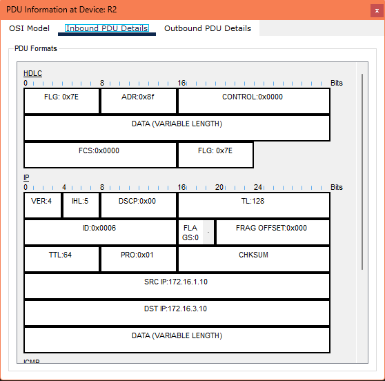
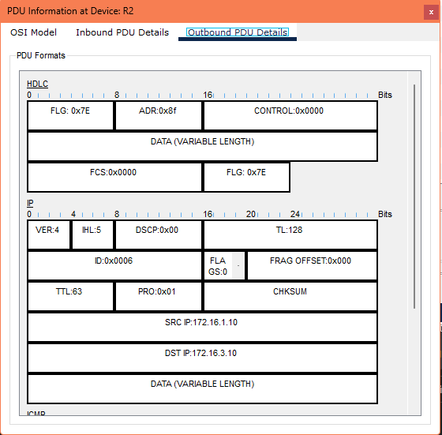
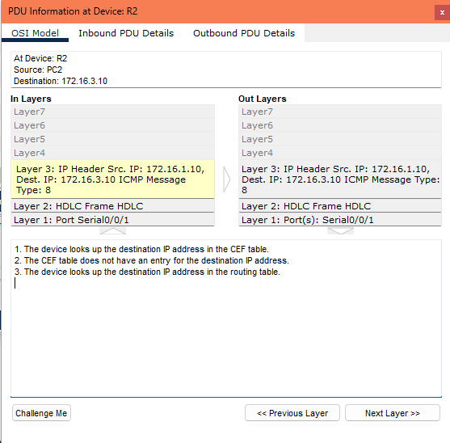
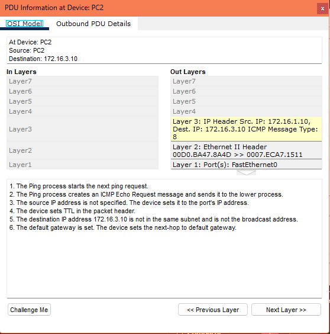
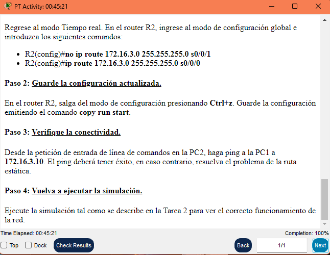

# 2.7.3: Resolución de la ruta que falta

## Tabla de direcciones

| Dispositivo | Interfaz | Dirección IP | Máscara de subred | Gateway por defecto |
|-------------|----------|--------------|--------------------|----------------------|
| R1          | Fa0/0    | 172.16.3.1   | 255.255.255.0      | N/A                  |
|             | S0/0/0   | 172.16.2.1   | 255.255.255.0      | N/A                  |
| R2          | Fa0/0    | 172.16.1.1   | 255.255.255.0      | N/A                  |
|             | S0/0/0   | 172.16.2.2   | 255.255.255.0      | N/A                  |
|             | S0/0/1   | 192.168.1.2  | 255.255.255.0      | N/A                  |
| R3          | Fa0/0    | 192.168.2.1  | 255.255.255.0      | N/A                  |
|             | S0/0/1   | 192.168.1.1  | 255.255.255.0      | N/A                  |
| PC1         | NIC      | 172.16.3.10  | 255.255.255.0      | 172.16.3.1           |
| PC2         | NIC      | 172.16.1.10  | 255.255.255.0      | 172.16.1.1           |
| PC3         | NIC      | 192.168.2.10 | 255.255.255.0      | 192.168.2.1          |

---

## Introducción

En esta actividad, examinaremos el problema de una ruta estática mal configurada descrito en esta sección. Utilizaremos el modo simulación del Packet Tracer para rastrear los paquetes en la red mal configurada. Corregiremos la red y observaremos el funcionamiento correcto.

---

## Objetivos de aprendizaje

- Examinar el router.
- Visualizar la configuración.
- Verificar la conectividad.
- Ver el problema en el modo Simulación.
- Ejecutar la simulación.
- Examinar los resultados.
- Corregir el problema y verificar.
- Reemplazar la ruta estática mal configurada.
- Verificar la conectividad.
- Volver a ejecutar la simulación.

---

## Tarea 1: Examen de la red

### Paso 1: Examine la configuración

En cada uno de los tres routers:

1. Conéctese al router utilizando la contraseña `cisco`.
2. Ingrese al modo exec privilegiado utilizando la contraseña `class`.
3. Introduzca el comando `show running-config` para ver cómo está configurado actualmente el enrutamiento estático.
4. Introduzca el comando `show ip route` para observar el efecto de la configuración.

```bash
User Access Verification

Password: 

R1>enable
Password: 
R1#show running-config
Building configuration...

Current configuration : 825 bytes
!
version 12.3
no service timestamps log datetime msec
no service timestamps debug datetime msec
no service password-encryption
!
hostname R1
!
!
!
enable secret 5 $1$.3RO$VLUOdBF2OqNBn0EjQBvR./
!
!
!
!
!
!
ip cef
no ipv6 cef

R1#show ip route
Codes: C - connected, S - static, I - IGRP, R - RIP, M - mobile, B - BGP
       D - EIGRP, EX - EIGRP external, O - OSPF, IA - OSPF inter area
       N1 - OSPF NSSA external type 1, N2 - OSPF NSSA external type 2
       E1 - OSPF external type 1, E2 - OSPF external type 2, E - EGP
       i - IS-IS, L1 - IS-IS level-1, L2 - IS-IS level-2, ia - IS-IS inter area
       * - candidate default, U - per-user static route, o - ODR
       P - periodic downloaded static route

Gateway of last resort is 0.0.0.0 to network 0.0.0.0

     172.16.0.0/24 is subnetted, 2 subnets
C       172.16.2.0 is directly connected, Serial0/0/0
C       172.16.3.0 is directly connected, FastEthernet0/0
S*   0.0.0.0/0 is directly connected, Serial0/0/0
```

### Paso 2: Verifique la conectividad

Desde la petición de entrada de línea de comandos en PC2, haga ping a la PC1 (`172.16.3.10`). El tiempo del ping expira.

```bash

C:\>ping 172.16.3.10

Pinging 172.16.3.10 with 32 bytes of data:

Request timed out.
Request timed out.
Request timed out.
Request timed out.

Ping statistics for 172.16.3.10:
    Packets: Sent = 4, Received = 0, Lost = 4 (100% loss),
```

## Tarea 2: Visualización del problema en modo Simulación

### Paso 1: Ejecute la simulación

1. Ingrese al modo Simulación.
2. La simulación está configurada para mostrar únicamente eventos ICMP.
3. La PDU en la PC2 es una solicitud de eco ICMP específicamente para la PC1.
4. Para acelerar el proceso, la PDU ha sido modificada para tener un valor TTL inicial de 15.
5. Ejecute la simulación haciendo clic en el botón **Capturar/Reproducir automáticamente**.
6. Vea la animación mientras los paquetes dan saltos para atrás y para adelante entre el router R2 y el router R3.
7. Cuando la simulación finalice, haga clic en el botón **Ver eventos anteriores** en el cuadro de diálogo *Búfer lleno*.

**Resultados: el paquete salta de R2 a R3 y luego vuelve a R2, repitiéndose este bucle. Esto ocurre porque la ruta estática está mal configurada en R2, como ya se confirmó.**

### Paso 2: Examine los resultados

1. Desplácese a la parte superior de la Lista de eventos.
2. Haga clic en el cuadro de color de la columna *Info* para obtener el primer evento. Se abre la ventana *Información de PDU*.
3. Examine la información de la **Capa 3** para las Capas internas y externas en la ficha *Modelo OSI*.
4. Examine también las fichas *Detalles de PDU de entrada* y *Detalles de PDU de salida*, y observe el valor en el campo **TTL**.
5. Vea la información de los otros eventos a medida que el campo TTL realiza la cuenta regresiva, el paquete es descartado y se envía un mensaje de tiempo superado al origen.
6. Sin este proceso, el paquete haría *loop* indefinidamente.







---

## Tarea 3: Corrección del problema y verificación

### Paso 1: Reemplace la ruta estática mal configurada

Regrese al modo Tiempo real. En el router R2:

```bash
R2(config)#no ip route 172.16.3.0 255.255.255.0 s0/0/1
R2(config)#ip route 172.16.3.0 255.255.255.0 s0/0/0
R2(config)#end
R2#copy running-config startup-config
```

### Paso 2: Guarde la configuración actualizada

1.En el router R2, salga del modo de configuración presionando Ctrl+z.
2.Guarde la configuración emitiendo el comando

```bash
R2#configure terminal
Enter configuration commands, one per line.  End with CNTL/Z.
R2(config)#no ip route 172.16.3.0 255.255.255.0
R2(config)#ip route 172.16.3.0 255.255.255.0 Serial0/0/0
R2(config)#end
R2#copy run start
```

### Paso 3: Verifique la conectividad

Desde la petición de entrada de línea de comandos en la PC2, haga ping a la PC1 a 172.16.3.10. El ping deberá tener éxito, en caso contrario, resuelva el problema de la ruta estática.

```bash
C:\>ping 172.16.3.10

Pinging 172.16.3.10 with 32 bytes of data:

Reply from 172.16.3.10: bytes=32 time=15ms TTL=126
Reply from 172.16.3.10: bytes=32 time=4ms TTL=126
Reply from 172.16.3.10: bytes=32 time=7ms TTL=126
Reply from 172.16.3.10: bytes=32 time=6ms TTL=126

Ping statistics for 172.16.3.10:
    Packets: Sent = 4, Received = 4, Lost = 0 (0% loss),
Approximate round trip times in milli-seconds:
    Minimum = 4ms, Maximum = 15ms, Average = 8ms
```

### Paso 4: Vuelva a ejecutar la simulación

Ejecute la simulación tal como se describe en la Tarea 2 para ver el correcto funcionamiento de la red.



**Actividad completada al 100%.**


