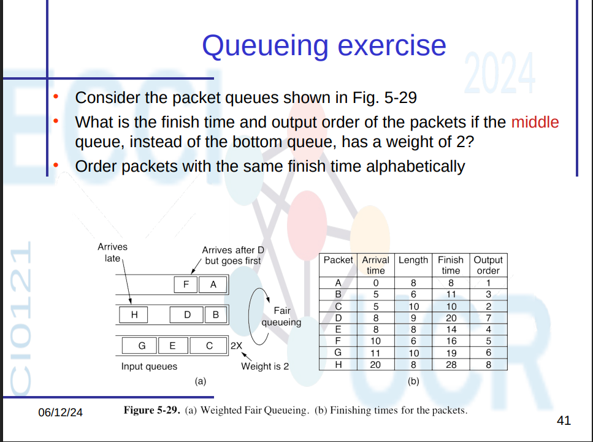
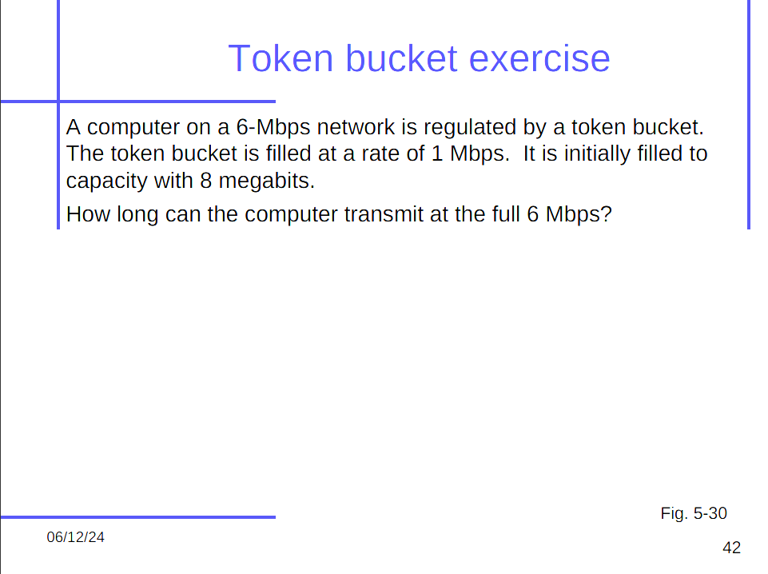

# Ejercicios de Calidad de Servicio (QoS)

## Ejercicio de Colas

¿Cuál es el tiempo de finalización y el orden de salida de los paquetes si la **cola del medio**, en lugar de la cola inferior, tiene un peso de 2?  
Ordena los paquetes con el mismo tiempo de finalización alfabéticamente.

### Configuración

- **Cola 1 (Peso 1)**: A, F  
- **Cola 2 (Peso 2)**: B, D, H  
- **Cola 3 (Peso 1)**: C, E, G  

### Longitudes y llegadas

| Paquete | Llegada | Longitud |
|---------|---------|----------|
| A       | 0       | 8        |
| B       | 5       | 6        |
| C       | 5       | 10       |
| D       | 8       | 9        |
| E       | 8       | 8        |
| F       | 10      | 6        |
| G       | 11      | 10       |
| H       | 20      | 8        |

### Cálculo del tiempo de finalización

Usamos la fórmula:

> `Finish Time = Arrival Time + (Length / Weight de la cola)`

| Paquete | Llegada | Longitud | Cola | Peso | Finish Time |
|---------|---------|----------|------|------|--------------|
| A       | 0       | 8        | Q1   | 1    | 8.0          |
| B       | 5       | 6        | Q2   | 2    | 8.0          |
| C       | 5       | 10       | Q3   | 1    | 15.0         |
| D       | 8       | 9        | Q2   | 2    | 12.5         |
| E       | 8       | 8        | Q3   | 1    | 16.0         |
| F       | 10      | 6        | Q1   | 1    | 16.0         |
| G       | 11      | 10       | Q3   | 1    | 21.0         |
| H       | 20      | 8        | Q2   | 2    | 24.0         |

### Orden de salida

Se ordenan por tiempo de finalización y luego alfabéticamente si hay empate.

| Orden | Paquete | Finish Time |
|-------|---------|--------------|
| 1     | A       | 8.0          |
| 2     | B       | 8.0          |
| 3     | D       | 12.5         |
| 4     | C       | 15.0         |
| 5     | E       | 16.0         |
| 6     | F       | 16.0         |
| 7     | G       | 21.0         |
| 8     | H       | 24.0         |

---

## Ejercicio de Token Bucket

Una computadora en una red de 6 Mbps está regulada por un token bucket.  

- El bucket se llena a 1 Mbps  
- Inicialmente tiene 8 megabits  
- Se transmite a 6 Mbps

### Solución

- **Tasa de consumo**: 6 Mbps  
- **Tasa de relleno**: 1 Mbps  
- **Consumo neto**: 6 - 1 = 5 Mbps  
- **Capacidad inicial**: 8 Mb

\[
t = \frac{8}{5} = 1.6 \text{ segundos}
\]

**Resultado:**  
La computadora puede transmitir a 6 Mbps durante **1.6 segundos** antes de agotar los tokens.
