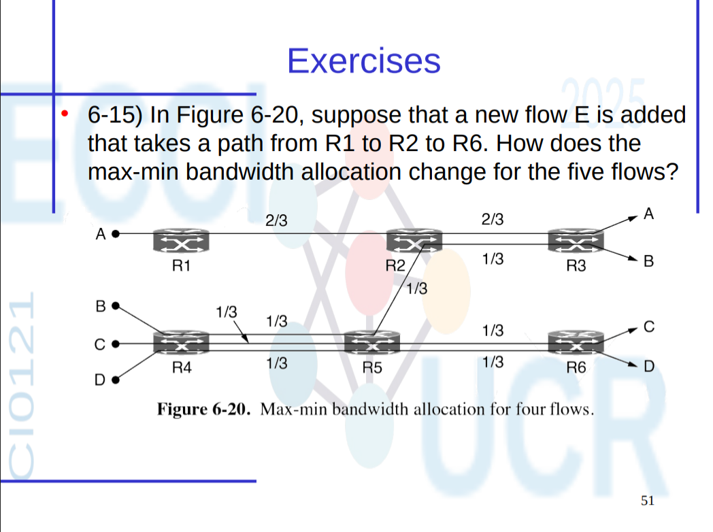
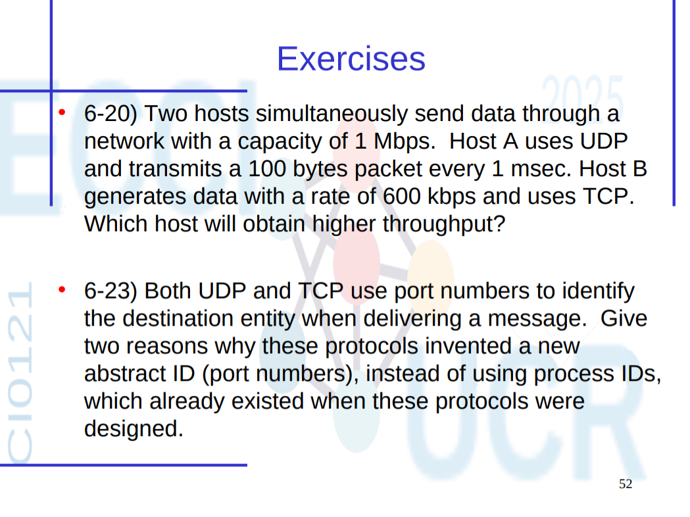

# Ejercicios de Transport Layer

## Respuesta al problema 6-15

## Asignaciones finales bajo max-min fairness

Después de añadir el flujo **E** (R1 → R2 → R6), las asignaciones de ancho de banda para cada flujo, considerando los cuellos de botella y el principio de max-min fairness, quedan de la siguiente forma:

| Flujo | Ruta                      | Asignación final |
|-------|---------------------------|------------------|
| A     | R1 → R2 → R3              | **1/3**          |
| B     | R4 → R5 → R2 → R3            | **1/3**          |
| C     | R4 → R5 → R6              | **1/3**          |
| D     | R4 → R5 → R6              | **1/3**          |
| E     | R1 → R2 → R6              | **1/3**          |

Al añadir el nuevo flujo **E**, que sigue el camino **R1 → R2 → R6**, la política de **max-min fairness** solo requiere modificar la asignación del **flujo A** que pasa de 2/3 a 1/3.

Esto se debe a que el enlace **R1 → R2**, que antes era usado exclusivamente por A, ahora es compartido con E y en luego en R2 con B. Por tanto, el ancho de banda en ese enlace se divide entre ellos, reduciendo la tasa de A de **2/3 a 1/3**, y asignando **1/3 a E**.

Aunque el nuevo flujo E también utiliza el enlace **R2 → R6**, que ya es compartido por otros flujos como **C y D**, **no se producen cambios en sus asignaciones**, ya que todos esos flujos (incluido E) terminan recibiendo **1/3**, lo cual respeta el criterio de equidad y no obliga a reducir a nadie más.

### En resumen

- El **único flujo afectado es A**, que pasa de 2/3 a **1/3**, por compartir el enlace **R1 → R2** con E.
- **E recibe 1/3**, tanto en **R1 → R2** como en **R2 → R6**.
- **B, C y D mantienen sus tasas de 1/3**, ya que los enlaces que comparten con E ya estaban operando en equilibrio.

## Ejercicio 6-20

**Respuesta:**  
Host A está enviando:  

- 100 bytes cada 1 ms → 100 bytes/ms = 800 kbps (porque 100 bytes = 800 bits)  

Host B usa **TCP**, que es sensible a congestión y comparte la capacidad con A.  
La red tiene **1 Mbps** de capacidad total.  

Como **UDP no reduce su tasa bajo congestión**, y **TCP sí lo hace**, el **Host A (UDP)** obtendrá **mayor throughput** porque continuará enviando a su tasa, mientras que TCP reducirá su ventana para adaptarse a la congestión.

**Conclusión:**  
**Host A obtendrá mayor throughput.**

---

## Ejercicio 6-23

**Respuesta:**

1. **Portabilidad e independencia del sistema operativo:**  
   Los números de puerto son abstracciones de nivel de red/transport que funcionan de forma uniforme entre distintos sistemas operativos. Los **Process IDs (PIDs)** son dependientes del sistema operativo y cambian con cada ejecución, por lo que **no son una forma confiable ni estable** de direccionar un proceso.

2. **Multiplexación y demultiplexación eficiente:**  
   Los números de puerto permiten que múltiples procesos usen el mismo protocolo y dirección IP al mismo tiempo. Por ejemplo, un servidor puede atender múltiples conexiones TCP en el mismo puerto 80 (HTTP), pero con diferentes IPs/puertos origen. Esto no sería posible con PIDs, ya que no permiten esta granularidad ni separación de contexto a nivel de red.

**Conclusión:**  
Los números de puerto son **abstractos, estables y reutilizables**, a diferencia de los PIDs, y permiten una comunicación más robusta y flexible en redes.
