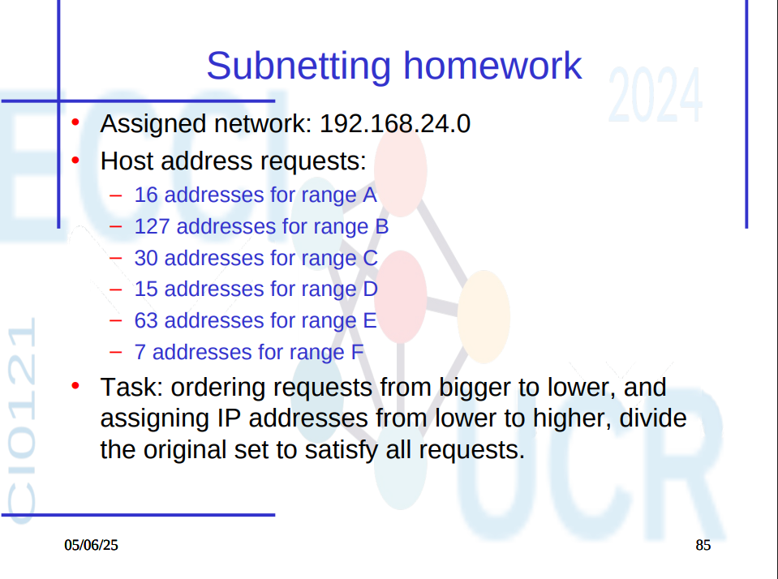

# Tarea Corta #5

## Datos del ejercicio

- **Red asignada:** `192.168.24.0`
- **Requerimientos de direcciones por rango:**

| Rango | Hosts requeridos |
|-------|------------------|
| B     | 127              |
| E     | 63               |
| C     | 30               |
| A     | 16               |
| D     | 15               |
| F     | 7                |

---

## Cálculo de subredes necesarias

| Rango | Hosts requeridos | Potencia mínima \(2^n - 2\) | IPs totales \(2^n\) | IPs útiles | Máscara |
|-------|------------------|-----------------------------|----------------------|-------------|----------------|
| B     | 127              | \(2^8 - 2 = 254\)            | 256                  | 254         | /24            |
| E     | 63               | \(2^7 - 2 = 126\)            | 128                  | 126         | /25            |
| C     | 30               | \(2^5 - 2 = 30\)             | 32                   | 30          | /27            |
| A     | 16               | \(2^5 - 2 = 30\)             | 32                   | 30          | /27            |
| D     | 15               | \(2^5 - 2 = 30\)             | 32                   | 30          | /27            |
| F     | 7                | \(2^4 - 2 = 14\)             | 16                   | 14          | /28            |

---

## Asignación de subredes

Subredes asignadas empezando desde `192.168.24.0`.

| Rango | Subred asignada     | Máscara  | Máscara decimal     | IPs válidas                       | Dirección de broadcast |
|-------|----------------------|-------|----------------------|-----------------------------------|-------------------------|
| B     | 192.168.24.0         | /24   | 255.255.255.0        | 192.168.24.1 – 192.168.24.254     | 192.168.24.255          |
| E     | 192.168.25.0         | /25   | 255.255.255.128      | 192.168.25.1 – 192.168.25.126     | 192.168.25.127          |
| C     | 192.168.25.128       | /27   | 255.255.255.224      | 192.168.25.129 – 192.168.25.158   | 192.168.25.159          |
| A     | 192.168.25.160       | /27   | 255.255.255.224      | 192.168.25.161 – 192.168.25.190   | 192.168.25.191          |
| D     | 192.168.25.192       | /27   | 255.255.255.224      | 192.168.25.193 – 192.168.25.222   | 192.168.25.223          |
| F     | 192.168.25.224       | /28   | 255.255.255.240      | 192.168.25.225 – 192.168.25.238   | 192.168.25.239          |

---
**Nota:** Una vez completamos para la máscara .24 pasamos a la .25..
