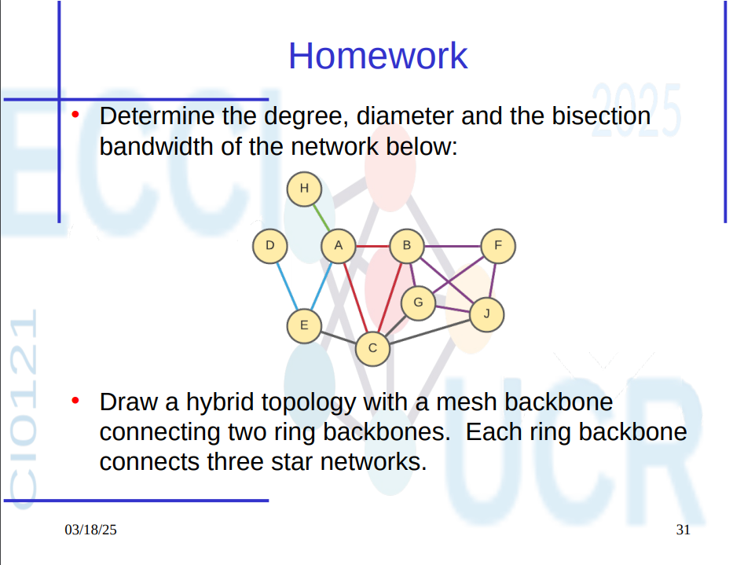
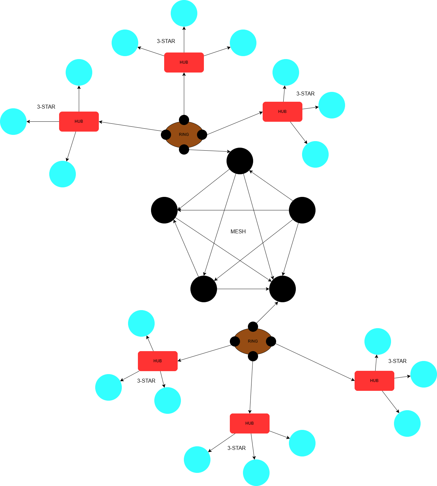

# Tarea 1.1

# Pregunta 1: Análisis de la Red

Se analiza la red dada en función de tres métricas fundamentales: grado, diámetro y ancho de banda de bisección.

## 1. Grado de la Red

El grado de un nodo es la cantidad de conexiones que tiene con otros nodos. A continuación se muestran los grados individuales de cada nodo:

- A: 4  
- B: 5  
- C: 5  
- D: 1  
- E: 3  
- F: 3  
- G: 4  
- H: 1  
- J: 4  

**Suma total de grados:** 30  
**Número total de nodos:** 9

Por lo tanto, el **grado de la red es aproximadamente 3.33**.

---
## 2. Diámetro de la Red

El diámetro de una red es la ruta más corta más larga entre cualquier par de nodos.

Para determinarlo, se calcula el camino más corto entre todos los pares posibles de nodos y se identifica cuál de ellos tiene la mayor cantidad de saltos.

Después de analizar el grafo, uno de los caminos más largos entre los caminos más cortos es: H → A → C → J → F (Hay otros con esta cantidad).

Este camino tiene **4 saltos**.

Por lo tanto, el **diámetro de la red es 4**.

## 3. Ancho de Banda de Bisección (Bisection Bandwidth)

El ancho de banda de bisección se determina dividiendo el conjunto de nodos en dos subconjuntos de tamaño igual o casi igual, y contando cuántos enlaces deben ser cortados para separar completamente ambos grupos.

En este caso, se propone la siguiente partición:

- **Grupo 1**: A, H, D, E  
- **Grupo 2**: B, C, G, F, J

Al analizar las conexiones entre estos dos grupos, se identifican los siguientes enlaces que cruzan la partición:

- A — B  
- A — C  
- E — C

**Total de enlaces que cruzan:** 3

Por lo tanto, el **ancho de banda de bisección (bisection bandwidth)** de esta red es:

**Bisection Bandwidth = 3**

## 2. Diseño de una Red con Diferentes Topologías

A continuación se propone un diseño de red según lo solicitado:

### 🔷 Topologías utilizadas

- **Topología en estrella** para la distribución centralizada de recursos.
- **Topología en anillo** para garantizar redundancia y comunicación directa entre nodos.
- **Topología en bus** para conectar subredes de forma eficiente con poco cableado.
