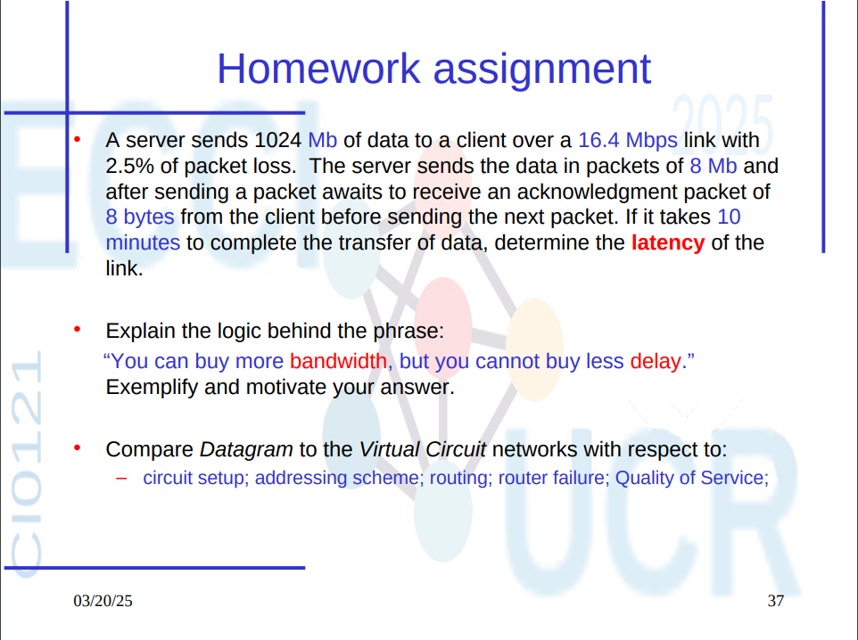
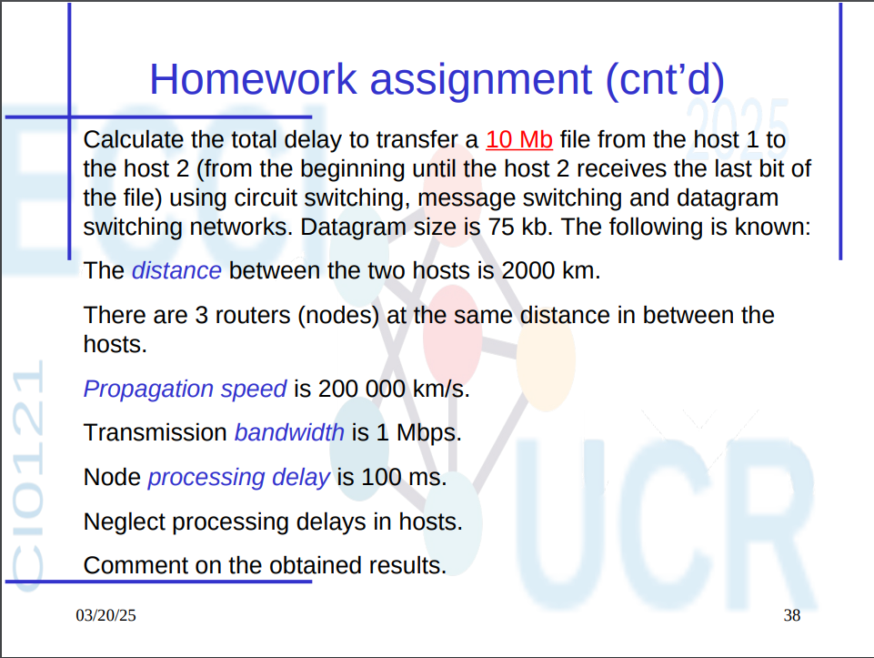

# Tarea 2 - Redes



---

## 1. Cálculo de la latencia del enlace

**Datos:**

- Tamaño total de datos: 1024 Mb  
- Ancho de banda del enlace: 16.4 Mbps  
- Tamaño de cada paquete: 8 Mb  
- Tamaño del ACK(paquete de confirmación): 8 bytes = 64 bits
- Pérdida de paquetes: 2.5%  
- Tiempo total de transferencia: 10 minutos = 600 s

**Cantidad de paquetes sin pérdidas:**
1024 Mb / 8 Mb = 128 paquetes

```bash

**Ajustando por pérdida de paquetes (2.5%):**
Valor esperado: E = 1 / 0.975 ≈ 1.0256 transmisiones por paquete 128 × 1.0256 ≈ 131.28 transmisiones
```

Esto significa que, en promedio, se necesitan **1.0256 intentos** para que un solo paquete sea transmitido correctamente debido a la pérdida del 2.5%.

**Tiempo de transmisión por paquete:**
8 Mb / 16.4 Mbps ≈ 0.4878 s

**Tiempo de transmisión del ACK:**
64 bits / 16.4 Mbps ≈ 3.9 µs

**Tiempo total esperado:**
131.28 × (0.4878039 + 2 × Latencia) = 600 s

Despejando la latencia (unidireccional):
Latencia ≈ 2.04 s

✅ **Respuesta:** La latencia del enlace es de aproximadamente **2.04 segundos**.

---

---

## 2. Explicación del principio: "You can buy more bandwidth, but you cannot buy less delay"

**Interpretación:**

- El **ancho de banda** se puede aumentar pagando por mejores conexiones.
- La **latencia** depende de factores físicos (como la distancia y la velocidad de propagación) y **no puede reducirse** fácilmente.

**Ejemplo:**

Entre dos ciudades a 1000 km de distancia:

- La velocidad de propagación es de ~200,000 km/s.
- El retardo mínimo físico es:
1000 km / 200,000 km/s = 0.005 s = 5 ms

Aunque se contrate 1 Gbps de ancho de banda, **la latencia mínima seguirá siendo de 5 ms**.

✅ **Conclusión:** Se puede pagar por transmitir más datos por segundo (más ancho de banda), pero **no se puede reducir el tiempo físico que tarda en llegar un bit (latencia)**.

---

## 3. Comparación: Red de Datagramas vs Red de Circuitos Virtuales

| Característica        | Red de Datagramas                  | Red de Circuitos Virtuales                |
|-----------------------|----------------------------------  |-------------------------------------------|
| Configuración         | No requiere                        | Requiere configuración previa             |
| Esquema de dirección  | Dirección completa en cada paquete | Solo en el establecimiento de la conexión |
| Enrutamiento          | Dinámico, por paquete              | Fijo durante toda la conexión             |
| Fallo del router      | Afecta algunos paquetes            | Puede interrumpir toda la conexión        |
| Calidad de Servicio   | Difícil de garantizar              | Más fácil de controlar                    |

---



## 4. Cálculo del retardo total para transferir un archivo de 10 Mb

**Datos:**

- Tamaño del archivo: 10 Mb  
- Distancia total: 2000 km  
- 3 nodos intermedios (4 enlaces)  
- Velocidad de propagación: 200,000 km/s  
- Ancho de banda: 1 Mbps  
- Retardo de procesamiento por nodo: 100 ms  
- Tamaño del datagrama: 75 kb = 0.075 Mb

---

### a) Circuit Switching

- Establecimiento del circuito: 4 × 100 ms = 0.4 s  
- Transmisión: 10 Mb / 1 Mbps = 10 s  
- Propagación total: 2000 / 200,000 = 0.01 s  

**Total:**
0.4 + 10 + 0.01 = 10.41 s

---

### b) Message Switching

- Cada nodo recibe el mensaje completo y luego lo reenvía (4 transmisiones):
4 × 10 s = 40 s (transmisión) 3 × 0.1 s = 0.3 s (procesamiento) 4 × 0.0025 s = 0.01 s (propagación)

**Total:**
40 + 0.3 + 0.01 = 40.31 s

---

### c) Datagram Switching

- 10 Mb / 0.075 Mb = ~134 datagramas  
- Tiempo de transmisión por datagrama: 0.075 Mb / 1 Mbps = 0.075 s  
- El primer datagrama tarda:
3 × 0.1 s + 4 × 0.0025 s + 0.075 s = 0.385 s

- Los siguientes llegan con un retraso de 0.075 s cada uno:
(134 - 1) × 0.075 = 10.025 s

**Total:**
0.385 + 10.025 = 10.41 s

---

### Comentario

- **Circuit switching** y **datagram switching** ofrecen tiempos similares (≈10.41 s), pero usan técnicas distintas.
- **Message switching** es mucho más lento debido a que cada nodo debe recibir el mensaje completo antes de reenviarlo.

---

## ¿Qué es un ACK?

Un **ACK** (Acknowledgment) es un mensaje de confirmación enviado por el receptor al emisor para indicar que un paquete fue recibido correctamente.  

- Es **mucho más pequeño** que el paquete original (por ejemplo, 8 bytes).
- No contiene los datos enviados, solo confirma su recepción.
- Se utiliza en protocolos como **TCP** para garantizar la entrega de datos.
- Si no se recibe un ACK, el emisor puede **retransmitir el paquete**, asumiendo pérdida.

 **Ejemplo:**  
Servidor envía un archivo → Cliente lo recibe → Cliente responde con un ACK pequeño (ej: "Recibido paquete 5").

---
