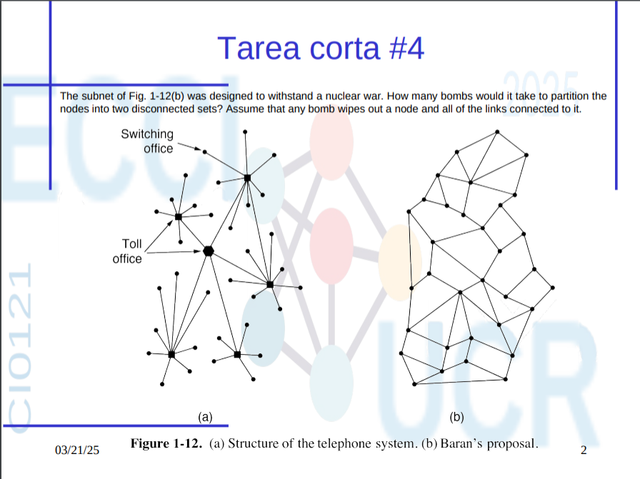

# Tarea Corta #3

## Parte A

## Pregunta 12

### Relacionar las capas —Link, Network y Transport— con las garantías que cada una podría proporcionar a las capas superiores

| Garantía                         | Capa       |
|---------------------------------|------------|
| Best effort delivery            | Red    |
| Reliable delivery               | Transporte  |
| In-order delivery               | Transporte |
| Byte-stream abstraction         | Transporte  |
| Point-to-point link abstraction | Link       |

---

## Pregunta 13

### Suponga que dos puntos finales de red tienen un tiempo de ida y vuelta (RTT) de 100 milisegundos, y que el emisor transmite cinco paquetes cada RTT. ¿Cuál será la tasa de transmisión del emisor para este tiempo de ida y vuelta, asumiendo paquetes de 1500 bytes? Dé su respuesta en bytes por segundo

### Datos

- RTT = 100 ms = 0.1 s
- 5 paquetes por RTT
- Tamaño de cada paquete = 1500 bytes

### Cálculo

Bytes transmitidos por RTT:

5 paquetes × 1500 bytes = 7500 bytes

Bytes transmitidos por segundo:
7500 bytes / 0.1 segundos = 75,000 bytes/segundo

### Respuesta Final

75,000 bytes/segundo

---

## Parte B

### ¿Cuántas bombas se necesitan para particionar los nodos en dos conjuntos desconectados, asumiendo que cualquier bomba elimina un nodo y todos sus enlaces?

### Respuesta

En la red propuesta por Baran (Figura 1-12b), se requieren al menos **3 bombas** para lograr particionar la red en dos conjuntos desconectados.

Esto se debe a que la red está diseñada con redundancia suficiente para soportar la pérdida de uno o dos nodos sin perder la conectividad global.

---
