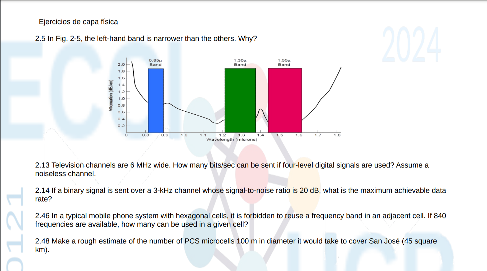

# Tarea Corta #3 – Ejercicios de Capa Física 

Este documento contiene explicaciones detalladas y referencias para los ejercicios seleccionados de Capa Física.



---

## Ejercicio 2.5 – Banda más estrecha en fibra óptica

### Explicación:
En la figura 2-5 se observa que la **ventana de 0.85 μ** (aproximadamente) es más estrecha que las otras (1.30 y 1.55 μ). Esto se debe a que, en esa región, la **atenuación de la señal en la fibra óptica** aumenta muy rápidamente fuera del mínimo, lo que restringe el rango útil de longitudes de onda. En cambio, en 1.30 μ y 1.55 μ, la curva de atenuación es más plana, permitiendo bandas útiles más amplias.

---

## Ejercicio 2.13 – Teorema de Nyquist (capacidad de un canal sin ruido)

### Explicación:
Si el canal es **sin ruido**, se usa el **teorema de Nyquist**, que determina la tasa máxima de transmisión sin errores basada en el ancho de banda y el número de niveles distintos que se pueden usar para codificar los datos:

```math
C = 2B \cdot \log_2 M
```

Donde:
- \(C\): capacidad del canal en bits por segundo
- \(B\): ancho de banda del canal (Hz)
- \(M\): número de niveles de señal distintos

Dado:
- Ancho de banda: \( B = 6\ \text{MHz} = 6 \cdot 10^6\ \text{Hz} \)
- Niveles de señal: \( M = 4 \) (es decir, 2 bits por símbolo ya que \(\log_2 4 = 2\))

Entonces:

```math
C = 2 \cdot 6 \cdot 10^6 \cdot \log_2(4) = 12 \cdot 10^6 \cdot 2 = 24 \cdot 10^6 = 24\ \text{Mbps}
```

### Resultado:

```math
\boxed{24\ \text{Mbps}}
```

### Referencia:
Math Stack Exchange (2015). *Noiseless channel capacity*. Recuperado de: [https://math.stackexchange.com/questions/1364319/noiseless-channel-capacity](https://math.stackexchange.com/questions/1364319/noiseless-channel-capacity)

---

## Ejercicio 2.14 – Teorema de Shannon-Hartley

### Explicación:
El teorema de Shannon-Hartley proporciona el límite teórico para la capacidad de un canal **con ruido**:

```math
C = B \cdot \log_2(1 + \mathrm{SNR})
```

Donde:
- \(C\): capacidad del canal (bps)
- \(B\): ancho de banda en Hz
- \(\mathrm{SNR}\): relación señal a ruido **en forma lineal** (no en dB)

Dado:
- \( B = 3,000\ \text{Hz} \)
- \( \mathrm{SNR}_{\text{dB}} = 20 \)

Primero, convertimos de decibelios (dB) a la forma lineal:

```math
\mathrm{SNR} = 10^{\frac{20}{10}} = 10^2 = 100
```

Esta conversión es necesaria porque la fórmula de Shannon usa \(\mathrm{SNR}\) como una relación directa, no logarítmica.

Ahora aplicamos la fórmula:

```math
C = 3000 \cdot \log_2(1 + 100) = 3000 \cdot \log_2(101) \approx 3000 \cdot 6.6582 \approx 19,974.6\ \text{bps}
```

### Resultado:

```math
\boxed{20,000\ \text{bps} \ (20\ \text{kbps})}
```

### Referencia:
Wikipedia. (s.f.). *Teorema de Shannon-Hartley*. Recuperado de: [https://es.wikipedia.org/wiki/Teorema_de_Shannon-Hartley](https://es.wikipedia.org/wiki/Teorema_de_Shannon-Hartley)

---

## Ejercicio 2.46 – Reutilización de Frecuencias en Celdas

### Explicación:
En redes celulares con celdas hexagonales, no se permite reutilizar frecuencias en celdas adyacentes para evitar interferencia co-canal. Por lo tanto, las frecuencias disponibles se dividen entre un grupo de celdas definido por el **factor de reutilización** \( N \).

Un valor común en diseño de redes celulares es:

```math
N = 7
```

Esto significa que cada grupo de 7 celdas usa un conjunto diferente de frecuencias, lo cual permite reutilizar de manera segura.

Si hay un total de 840 frecuencias disponibles:

```math
\frac{840}{7} = 120\ \text{frecuencias por celda}
```

### Resultado:

```math
\boxed{120\ \text{frecuencias por celda}}
```

### Referencia:
Universidad Politécnica de Madrid. (s.f.). *Capítulo 4: Sistemas celulares clásicos (FDMA/TDMA)*. Recuperado de: [https://moodle.upm.es/en-abierto/pluginfile.php/190/mod_label/intro/capitulo-4.-sistemas-celulares-clasicos-fdma-tdma-1.pdf](https://moodle.upm.es/en-abierto/pluginfile.php/190/mod_label/intro/capitulo-4.-sistemas-celulares-clasicos-fdma-tdma-1.pdf)

---

## Ejercicio 2.48 – Estimación de Microceldas para San José

### Explicación:
Se desea estimar cuántas microceldas de \(100\ \text{m}\) de diámetro son necesarias para cubrir San José, cuya superficie es de \(45\ \text{km}^2\). 
En este caso vamos a usar un hexágono ya que es el modelo que se utiliza normalmente.

Convertimos el área total:

```math
45\ \text{km}^2 = 45,000,000\ \text{m}^2
```

Cada microcelda se modela como un hexágono regular con radio:

```math
r = \frac{100}{2} = 50\ \text{m}
```

Área de una celda hexagonal:

```math
A = \frac{3\sqrt{3}}{2} \cdot r^2 = \frac{3\sqrt{3}}{2} \cdot 2500 \approx 6495\ \text{m}^2
```

Dividimos el área total entre el área de una celda:

```math
N = \frac{45,000,000}{6495} \approx 6,929
```

### Resultado:

```math
\boxed{6,929\ \text{microceldas}}
```
