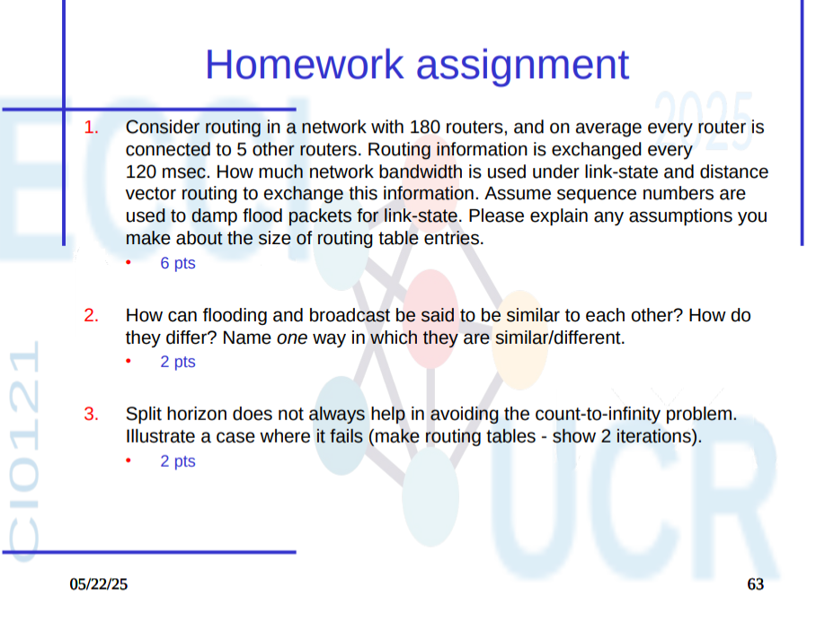
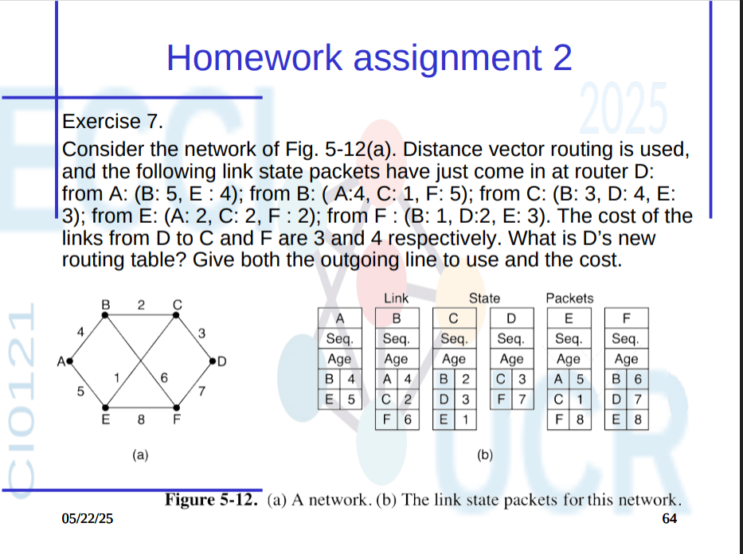

# Tarea Corta #8

## Filmina 63

## Pregunta 1

**Consider routing in a network with 180 routers, and on average every router is connected to 5 other routers. Routing information is exchanged every 120 msec. How much network bandwidth is used under link-state and distance vector routing to exchange this information. Assume sequence numbers are used to damp flood packets for link-state. Please explain any assumptions you make about the size of routing table entries.**

---

### Supuestos

- Total de routers: **180**
- Conexiones promedio por router: **5**
- Intervalo de actualización: **120 ms**
- Tamaño asumido para una entrada de tabla: **32 bytes**
- Cada entrada contiene: dirección destino, costo, TTL, y otros datos.
- La red está conectada, sin ciclos innecesarios.
- Cada LSP en Link-State se propaga a todos los routers.
- Distance Vector se intercambia solo con vecinos directos.

---

### Link-State Routing

- Cada router envía información de **sus enlaces directos**.
- Cada LSP contiene 5 enlaces → `5 × 32 bytes = 160 bytes` por LSP.
- Cada router genera 1 LSP → `180 × 160 = 28,800 bytes` en total.

**Pero**, como se propaga por flooding a los vecinos (promedio 5):

- `180 routers × 5 vecinos × 160 bytes = 144,000 bytes` transmitidos por actualización.

**Uso de ancho de banda con Link-State:** **~144 KB cada 120 ms**

---

### Distance Vector Routing

- Cada router envía su **tabla completa de rutas** a cada uno de sus 5 vecinos.
- Tamaño de tabla ≈ `179 entradas × 32 bytes = 5,728 bytes`
- Cada router envía esto a 5 vecinos → `5 × 5,728 = 28,640 bytes`

- Total en la red: `180 × 28,640 = 5,155,200 bytes`

**Uso de ancho de banda con Distance Vector:** **~5.15 MB cada 120 ms**

---

### Comparación final

| Método              | Ancho de Banda (cada 120 ms) |
|---------------------|------------------------------|
| **Link-State**      | ~144 KB                      |
| **Distance Vector** | ~5.15 MB                     |

---

## Pregunta 2

**How can flooding and broadcast be said to be similar to each other? How do they differ? Name _one_ way in which they are similar/different.**

---

### Similitud entre Flooding y Broadcast

Ambos métodos **intentan entregar un mensaje a todos los nodos** de una red. La intención es que **todos reciban la misma información**, independientemente de su dirección específica. Son útiles en la propagación inicial de información de control (como descubrimiento de rutas).

---

### Diferencia

**Flooding** reenvía el paquete a **todos los enlaces excepto el de llegada**, sin saber si los vecinos ya lo recibieron.

**Broadcast**, en cambio, **utiliza una dirección especial (por ejemplo, 255.255.255.255 en IPv4)** para entregar directamente el mensaje a **todos los hosts** dentro de la red local, y el reenvío depende del protocolo.

---

## Pregunta 3

**Split horizon does not always help in avoiding the count-to-infinity problem. Illustrate a case where it fails (make routing tables – show 2 iterations).**

---

### Recordatorio: Qué es Split Horizon?

Split horizon es una regla utilizada en Distance Vector Routing que dice:

> "Nunca anuncies una ruta a un vecino desde el mismo vecino del cual aprendiste esa ruta."

Esto ayuda a evitar bucles simples, pero **no resuelve todos los casos**.

---

### Qué es el problema de conteo hasta el infinito (count-to-infinity)?

Es un problema en protocolos de vector distancia donde un router tarda mucho en enterarse que una ruta ya no está disponible, y sigue incrementando el costo indefinidamente.

---

### Caso donde falla Split Horizon

Considere esta red: A --- B --- C

- Costos: todos los enlaces valen 1
- Todas las rutas están inicialmente estables
- Split horizon está habilitado

#### Iteración 0 (Estado inicial)

| Router | Destino | Vía | Costo |
|--------|---------|-----|-------|
| A      | B       | B   | 1     |
| A      | C       | B   | 2     |
| B      | A       | A   | 1     |
| B      | C       | C   | 1     |
| C      | B       | B   | 1     |
| C      | A       | B   | 2     |

#### Falla: C se cae

Suponga que **C falla** de repente (se apaga). Aún así:

- B no puede decirle a A que aprendió de C (por Split Horizon).
- Pero A **cree** que puede llegar a C a través de B.

#### Iteración 1

| Router | Destino | Vía | Costo |
|--------|---------|-----|-------|
| A      | C       | B   | 2     |
| B      | C       | A   | 3      ← Aún cree que A tiene una ruta

Ambos routers ahora **se engañan mutuamente** porque Split Horizon impide una corrección inmediata.

#### Iteración 2

| Router | Destino | Vía | Costo |
|--------|---------|-----|-------|
| A      | C       | B   | 4     |
| B      | C       | A   | 5     |

Y así continúa el aumento del costo... hasta que se alcanza el máximo (que se considera infinito).

---

### Conclusión

**Split horizon resuelve algunos bucles, pero no evita que dos routers se engañen entre sí si pierden conexión con un tercer nodo común.** Por eso, otros mecanismos  son necesarios.

## Filmina 64

**Enunciado:**  
Consider the network of Fig. 5-12(a). Distance vector routing is used, and the following link state packets have just come in at router D:  

- from A: (B: 5, E: 4)  
- from B: (A: 4, C: 1, F: 5)  
- from C: (B: 3, D: 4, E: 3)  
- from E: (A: 2, C: 2, F: 2)  
- from F: (B: 1, D: 2, E: 3)  

The cost of the links from D to C and F are 3 and 4 respectively.  
**Pregunta:** What is D’s new routing table? Give both the outgoing line to use and the cost.

---

### Enlaces directos de D

| Vecino | Costo |
|--------|-------|
| C      | 3     |
| F      | 4     |

---

### Información recibida por D

| Desde | Vecinos informados |
|-------|--------------------|
| A     | B: 5, E: 4         |
| B     | A: 4, C: 1, F: 5   |
| C     | B: 3, D: 4, E: 3   |
| E     | A: 2, C: 2, F: 2   |
| F     | B: 1, D: 2, E: 3   |

---

### Cálculo de rutas

#### A (Destino)

- Vía B:
  - D → F (4), F → B (1), B → A (4)  
  - Total: 4 + 1 + 4 = **9**
- Vía E:
  - D → F (4), F → E (3), E → A (2)  
  - Total: 4 + 3 + 2 = **9**
- Mínimo: **9 vía F**

---

#### B (Destino)

- Vía C:
  - D → C (3), C → B (3)  
  - Total: 3 + 3 = **6**
- Vía F:
  - D → F (4), F → B (1)  
  - Total: 4 + 1 = **5**
- Mínimo: **5 vía F**

---

#### C (Destino)

- Directo: D → C = **3**
- Ruta directa: **3 vía C**

---

#### E (Destino)

- Vía C:
  - D → C (3), C → E (3)  
  - Total: 3 + 3 = **6**
- Vía F:
  - D → F (4), F → E (3)  
  - Total: 4 + 3 = **7**
- Mínimo: **6 vía C**

---

#### F (Destino)

- Directo: D → F = **4**
- Ruta directa: **4 vía F**

---

### Tabla final de enrutamiento para D

| Destino | Próximo salto | Costo |
|---------|----------------|-------|
| A       | F              | 9     |
| B       | F              | 5     |
| C       | C              | 3     |
| E       | C              | 6     |
| F       | F              | 4     |

---
