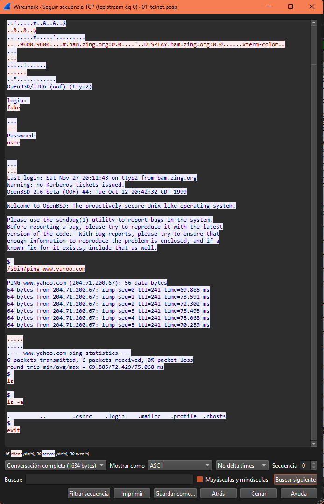
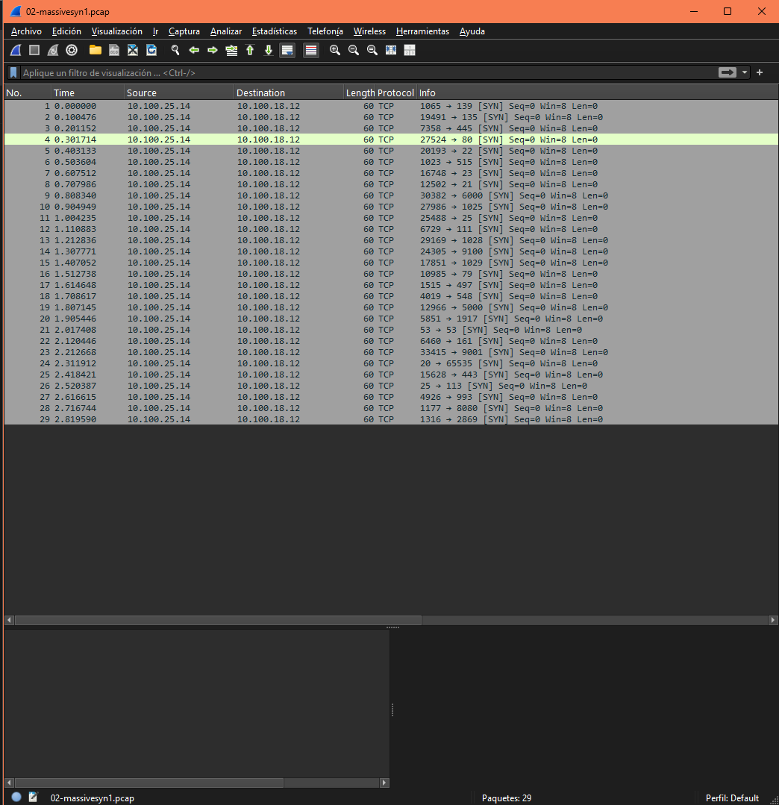
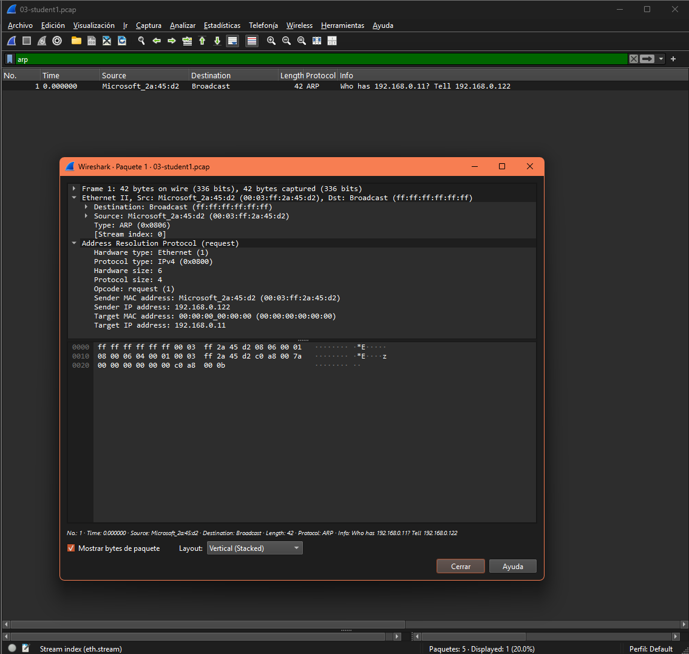
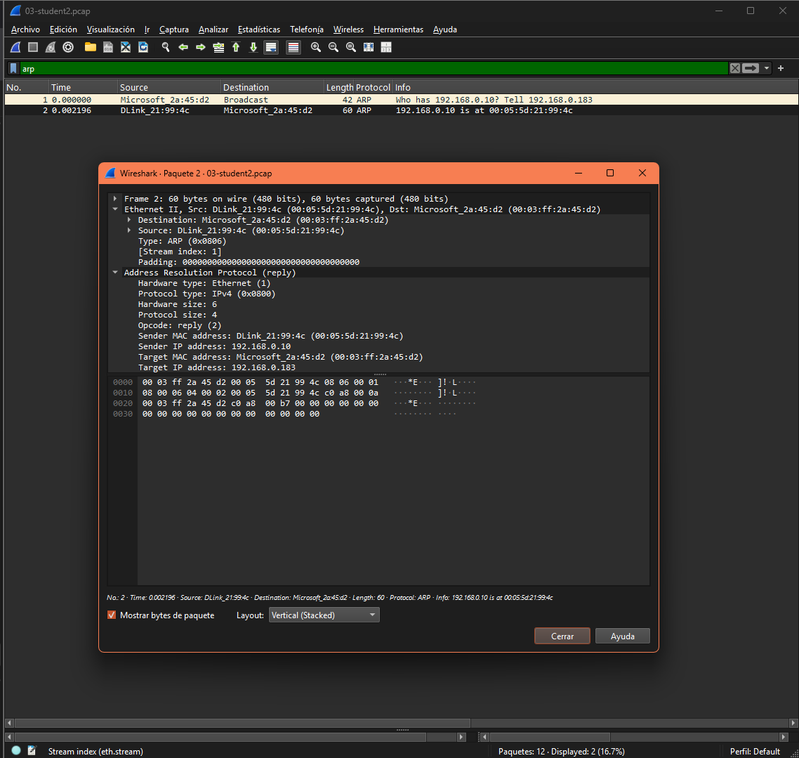
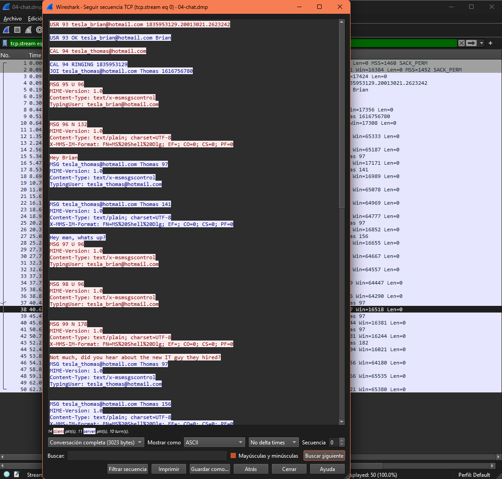

# I) Exercise One: Good old telnet

File: telnet.pcap
Work: reconstruct the telnet session
Questions

1. Who logged into 192.168.0.1?
Username:**fake** Password: **user**
2. After logged what the user do?
Ejecutó el comando:

```bash
/sbin/ping <www.yahoo.com>
```

Listó archivos con:

```bash
ls y ls -a
```

Cerró la sesión con:

```bash
exit
```



**Para hacer esto, apliqué filtro de telnet, click derecho sobre cualquier paquete, opción de seguir o follow TCP Stream y ahí se ve la info en texto plano**

**TIP: telnet traffic is not secure**

## II) Exercise two: massive TCP SYN

File: massivesyn1.pcap and massivesyn2.pcap
Work: Find files differences
Questions

1. massivesyn1.pcap is a **port scan** attempt(para descubrir qué servicios están activos en una máquina)


2. massivesyn2.pcap is a **SYN flood distributed denial-of-service(DDoS)** attempt(muchas IPs de origen distinto, envían muchos SYNs a uno o pocos destinos, en poco tiempo...)


**TIP: pay attention to source IP**

## III) Exercise three: compare traffic

Files: student1.pcap and student2.pcap
Scenario: You are an IT admin in UCR, you had reported that student1 (a new student)
cannot browse or mail with its laptop. After some research, student2, sitting next to
student1, can browse with any problems.
Work: compare these two capture files and state why student1’s machine is not online
Solution





**Comparación:**
La computadora de Student1 envía solicitudes ARP del tipo:
"¿Quién tiene 192.168.0.11? Dígale a 192.168.0.122",
pero no recibe ninguna respuesta.

En cambio, la computadora de Student2 sí recibe una respuesta ARP del gateway, indicando que su comunicación con la red es funcional.

1. student1 must **verificar su conexión física o su configuración de red, ya que no está recibiendo respuestar ARP del gateway**

**TIP: pay attention to first ARP package**

## IV) Exercise four: chatty employees

File: chat.pcap
Question

1. What kind of protocol is used?
**MSNMS (Microsoft Messenger Service Protocol)**
Se utiliza el protocolo MSNMS, correspondiente al servicio de mensajería de MSN Messenger, basado en el protocolo MSNP (Microsoft Notification Protocol).

2. Who are the chatters?
<tesla_brian@hotmail.com> (Brian)
<tesla_thomas@hotmail.com> (Thomas)

3. What do they say about you (sysadmin)?
Dicen que “es un verdadero imbécil” ("a real jerk")
Comentan: “maybe we should try hacking into a server to mess with him?”
Y Brian responde: “sounds good to me”



**TIP: your chat can be monitored by network admin**
